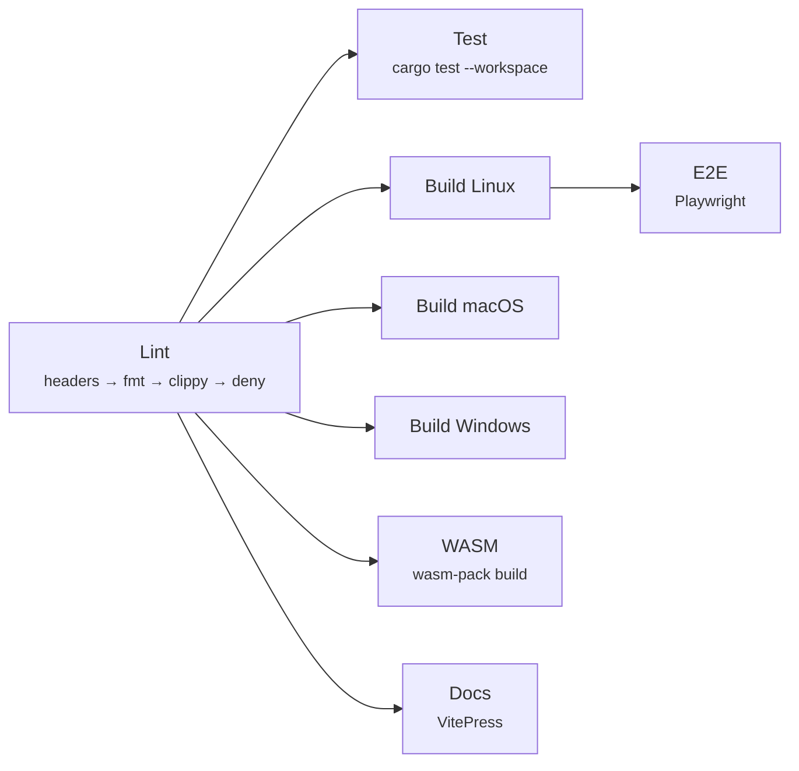
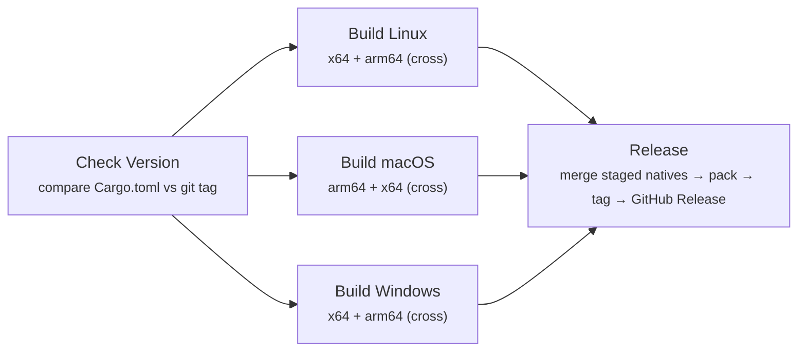

# WebUI

**WebUI** is a high-performance, language-agnostic server-side rendering framework built in Rust. It compiles HTML templates into Protocol Buffer binaries at build time — eliminating per-request template parsing entirely. On the client, Web Components hydrate as interactive islands using the [Islands Architecture](https://microsoft.github.io/webui/guide/concepts/how-it-works), where only components that need interactivity ship JavaScript.

> 📖 **[Full Documentation →](https://microsoft.github.io/webui)**

### Highlights

- **Compiled to binary** — Templates are parsed once at build time into a compact protobuf protocol. Runtime just applies state.
- **Language agnostic** — Native support for Rust, Node/Bun/Deno, C#, Python, Go. Any other language via the C FFI.
- **Web Components** — Built on native web components with Shadow DOM encapsulation.
- **Server-side logic** — Conditionals and expressions evaluated on the server, not in the browser.
- **Plugin system** — Parser and handler plugins for hydration, adding reactivity to interactive islands, custom directives, and framework-specific behavior.

## Documentation

Visit **[microsoft.github.io/webui](https://microsoft.github.io/webui)** for:

- [Getting Started Guide](https://microsoft.github.io/webui/guide/) — What is WebUI and how to install it
- [How It Works](https://microsoft.github.io/webui/guide/concepts/how-it-works) — Build → Render → Hydrate pipeline
- [Interactivity Guide](https://microsoft.github.io/webui/guide/concepts/interactivity) — Web Components with `@attr`, `@observable`, events
- [CLI Reference](https://microsoft.github.io/webui/guide/cli/) — `webui build`, `webui serve`, `webui inspect`
- [Language Integrations](https://microsoft.github.io/webui/guide/integrations) — Rust, Node, Go, C#, Python
- [React vs Web Components](https://microsoft.github.io/webui/guide/concepts/react-comparison) — Side-by-side comparison with React
- [Playground](https://microsoft.github.io/webui/playground/) — Try WebUI in the browser
- [Tutorials](https://microsoft.github.io/webui/tutorials/hello-world) — Hello World, Todo App

## Install

```bash
npm install @microsoft/webui
```

Or with Rust: `cargo install microsoft-webui-cli`

## Development

### Prerequisites

- Rust 1.93+ with `clippy` and `rustfmt`
- Node.js 22+ with pnpm

### Commands

All development tasks go through `cargo xtask`:

| Command | Description |
|---------|-------------|
| `cargo xtask check` | **Run before every commit.** Parallel lint → test → build → docs |
| `cargo xtask e2e` | Run Playwright E2E tests for all example apps |
| `cargo xtask fmt` | Check formatting |
| `cargo xtask clippy` | Run clippy lints |
| `cargo xtask deny` | License & advisory audit |
| `cargo xtask test` | Run all tests |
| `cargo xtask build` | Build the workspace + examples |
| `cargo xtask build-wasm` | Build WASM playground module |
| `cargo xtask docs` | Build the documentation site |
| `cargo xtask bench <crate>` | Run benchmarks (parser, handler, protocol, expressions, state, all) |
| `cargo xtask dev <app>` | Run example app in dev mode |
| `cargo xtask version <semver>` | Update version across all Cargo.toml and package.json files |
| `cargo xtask publish-stage` | Stage release artifacts into `publish/` (supports `--native-only` and `--pack-only`) |

### CI Pipelines

#### PR Checks (`pr.yml`)

The CI workflow parallelizes across jobs with dependency ordering:



| Phase | Jobs (parallel) | Runner |
|-------|----------------|--------|
| 1 | **lint** | Ubuntu |
| 2 | **test** + **build** (Linux · macOS · Windows) + **wasm** + **docs** | Ubuntu · macOS · Windows |
| 3 | **e2e** (after Linux build) | Ubuntu (shared Rust cache) |

#### Publish (`publish.yml`)

Triggered on push to `main` (and `workflow_dispatch`). Skips if the version hasn't changed.



Each build runner uploads only the platform-native inputs it produced:

- `publish/native/` direct-download CLI binaries
- `packages/webui-*` directories populated with the platform CLI + Node addon
- `dotnet/runtimes/*` directories populated with the platform FFI library

The release job merges those staged files and then runs `cargo xtask publish-stage --pack-only`
once on Linux to build the final `publish/` folder:

| Subfolder | Contents | Target registry |
|-----------|----------|-----------------|
| `publish/npm/` | `.tgz` tarballs (8 packages) | npmjs |
| `publish/nuget/` | `.nupkg` files (2 packages) | NuGet |
| `publish/crates/` | `.crate` files (12 crates) | crates.io |
| `publish/wasm/` | `.wasm` + `.js` glue | CDN / static hosting |
| `publish/native/` | CLI binaries per platform | Direct download |

**Release workflow:** `cargo xtask version 0.2.0` → commit → merge to `main` → CI auto-tags `v0.2.0` → creates GitHub Release with all artifacts.

Screenshot baselines are generated on CI (Ubuntu). When e2e fails, CI automatically re-runs with `--update-snapshots` and uploads the corrected baselines as an artifact. Use `cargo xtask e2e-approve` to download and apply them.

### E2E Testing

E2E tests use [Playwright](https://playwright.dev). Screenshot baselines are the CI runner's source of truth — locally, visual regression tests may differ due to platform fonts.

| Command | Description |
|---------|-------------|
| `cargo xtask e2e` | Run E2E tests |
| `cargo xtask e2e --update-snapshots` | Regenerate screenshot baselines locally |
| `cargo xtask e2e-approve` | Download CI baselines from the latest run on your branch |
| `cargo xtask e2e-approve <run-id>` | Download CI baselines from a specific run |

**Workflow for visual changes:**
1. Push your branch → CI runs e2e
2. If screenshots fail → CI regenerates baselines and uploads `e2e-updated-baselines` artifact
3. Inspect the `e2e-test-results` artifact to review diffs (actual vs expected)
4. If the new rendering is correct → run `cargo xtask e2e-approve` → review with `git diff` → commit

Locally, `cargo xtask check` uses the same phased parallelism:
- Phase 1: `license-headers → fmt → clippy` (sequential, fail-fast)
- Phase 2: `deny + test` (parallel)
- Phase 3: `build + build-wasm` (parallel)
- Phase 4: `build-examples + bench + docs` (parallel, examples built concurrently)

### Project Structure

```
crates/
├── webui/              # Library API (build, inspect, re-exports)
├── webui-cli/          # CLI binary
├── webui-node/         # Node.js native addon (napi-rs)
├── webui-ffi/          # C-compatible FFI bindings
├── webui-wasm/         # WebAssembly bindings
├── webui-parser/       # HTML/CSS parser
├── webui-protocol/     # Protocol definition (protobuf)
├── webui-handler/      # Rendering engine
├── webui-expressions/  # Expression evaluator
├── webui-state/        # State management
├── webui-discovery/    # Component discovery
└── webui-test-utils/   # Shared test helpers
packages/
└── webui/              # @microsoft/webui npm package
docs/                   # VitePress documentation site
```

### Key Files

- [`DESIGN.md`](DESIGN.md) — Technical specification (the source of truth)
- [`clippy.toml`](clippy.toml) — Lint policy (no `unwrap`/`expect`, complexity ≤ 20)
- [`deny.toml`](deny.toml) — License allowlist & advisory audit

## Contributing

This project welcomes contributions and suggestions. Most contributions require you to agree to a
Contributor License Agreement (CLA) declaring that you have the right to, and actually do, grant us
the rights to use your contribution. For details, visit https://cla.opensource.microsoft.com.

When you submit a pull request, a CLA bot will automatically determine whether you need to provide
a CLA and decorate the PR appropriately (e.g., status check, comment). Simply follow the instructions
provided by the bot. You will only need to do this once across all repos using our CLA.

This project has adopted the [Microsoft Open Source Code of Conduct](https://opensource.microsoft.com/codeofconduct/).
For more information see the [Code of Conduct FAQ](https://opensource.microsoft.com/codeofconduct/faq/) or
contact [opencode@microsoft.com](mailto:opencode@microsoft.com) with any additional questions or comments.

## Trademarks

This project may contain trademarks or logos for projects, products, or services. Authorized use of Microsoft
trademarks or logos is subject to and must follow
[Microsoft's Trademark & Brand Guidelines](https://www.microsoft.com/en-us/legal/intellectualproperty/trademarks/usage/general).
Use of Microsoft trademarks or logos in modified versions of this project must not cause confusion or imply Microsoft sponsorship.
Any use of third-party trademarks or logos are subject to those third-party's policies.

## License

MIT
