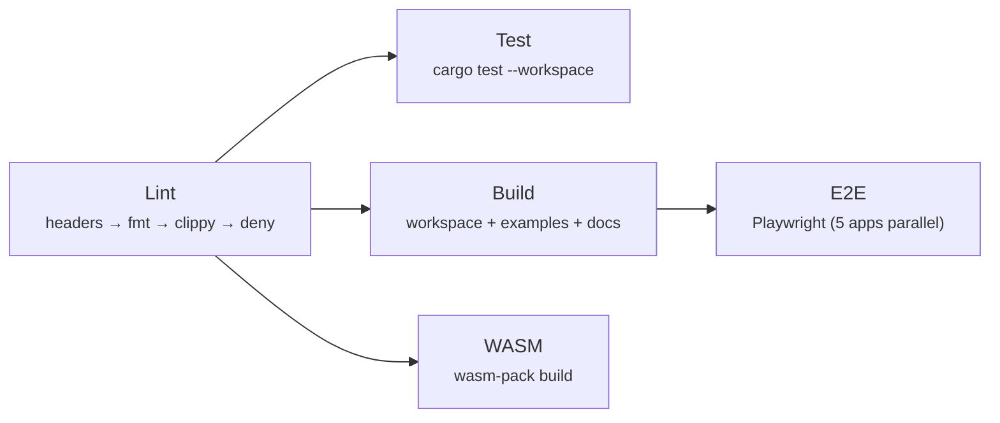

# WebUI

Web rendering without a JavaScript runtime. Compile templates to binary. Serve them instantly from any backend.

WebUI is a high-performance server-side rendering framework built in Rust. It compiles HTML templates into a Protocol Buffer binary at build time, separating static structure from dynamic content. At runtime, your backend (Rust, Node, Bun, Deno, C#, Python, Go — or any language via FFI) simply fills in state data and gets rendered HTML back. No template parsing, no JS runtime, minimal work.

**📖 Documentation → [microsoft.github.io/webui](https://microsoft.github.io/webui)**

### Highlights

- **Compiled to binary** — Templates are parsed once at build time into a compact protobuf protocol. Runtime just applies state.
- **Language agnostic** — Native support for Rust, Node/Bun/Deno, C#, Python, Go. Any other language via the C FFI.
- **Web Components** — Built on native web components with Shadow DOM encapsulation.
- **Server-side logic** — Conditionals and expressions evaluated on the server, not in the browser.
- **Plugin system** — Parser and handler plugins for hydration, adding reactivity to interactive islands, custom directives, and framework-specific behavior.

## Install

```bash
npm install @microsoft/webui
```

Or with Rust: `cargo install webui-cli`

## Development

### Prerequisites

- Rust 1.93+ with `clippy` and `rustfmt`
- Node.js 22+ with pnpm

### Commands

All development tasks go through `cargo xtask`:

| Command | Description |
|---------|-------------|
| `cargo xtask check` | **Run before every commit.** Parallel lint → test → build → docs |
| `cargo xtask e2e` | Run Playwright E2E tests for all example apps in parallel |
| `cargo xtask fmt` | Check formatting |
| `cargo xtask clippy` | Run clippy lints |
| `cargo xtask deny` | License & advisory audit |
| `cargo xtask test` | Run all tests |
| `cargo xtask build` | Build the workspace + examples |
| `cargo xtask build-wasm` | Build WASM playground module |
| `cargo xtask docs` | Build the documentation site |
| `cargo xtask bench <crate>` | Run benchmarks (parser, handler, protocol, expressions, state, all) |
| `cargo xtask dev <app>` | Run example app in dev mode |
| `cargo xtask version <semver>` | Update version across all Cargo.toml and package.json files |

### CI Pipeline

The CI workflow parallelizes across 5 jobs with dependency ordering:



| Phase | Jobs (parallel) | Estimated |
|-------|----------------|-----------|
| 1 | **lint** | ~45s |
| 2 | **test** + **build** + **wasm** | ~60s |
| 3 | **e2e** (after build) | ~90s |

Total wall time: **~3 min** (vs ~8 min sequential).

Locally, `cargo xtask check` uses the same phased parallelism:
- Phase 1: `license-headers → fmt → clippy` (sequential, fail-fast)
- Phase 2: `deny + test` (parallel)
- Phase 3: `build + build-wasm` (parallel)
- Phase 4: `build-examples + bench + docs` (parallel, examples built concurrently)

### Project Structure

```
crates/
├── webui/              # Library API (build, inspect, re-exports)
├── webui-cli/          # CLI binary
├── webui-node/         # Node.js native addon (napi-rs)
├── webui-ffi/          # C-compatible FFI bindings
├── webui-wasm/         # WebAssembly bindings
├── webui-parser/       # HTML/CSS parser
├── webui-protocol/     # Protocol definition (protobuf)
├── webui-handler/      # Rendering engine
├── webui-expressions/  # Expression evaluator
├── webui-state/        # State management
├── webui-discovery/    # Component discovery
└── webui-test-utils/   # Shared test helpers
packages/
└── webui/              # @microsoft/webui npm package
docs/                   # VitePress documentation site
```

### Key Files

- [`DESIGN.md`](DESIGN.md) — Technical specification (the source of truth)
- [`clippy.toml`](clippy.toml) — Lint policy (no `unwrap`/`expect`, complexity ≤ 20)
- [`deny.toml`](deny.toml) — License allowlist & advisory audit

## Contributing

This project welcomes contributions and suggestions. Most contributions require you to agree to a
Contributor License Agreement (CLA) declaring that you have the right to, and actually do, grant us
the rights to use your contribution. For details, visit https://cla.opensource.microsoft.com.

When you submit a pull request, a CLA bot will automatically determine whether you need to provide
a CLA and decorate the PR appropriately (e.g., status check, comment). Simply follow the instructions
provided by the bot. You will only need to do this once across all repos using our CLA.

This project has adopted the [Microsoft Open Source Code of Conduct](https://opensource.microsoft.com/codeofconduct/).
For more information see the [Code of Conduct FAQ](https://opensource.microsoft.com/codeofconduct/faq/) or
contact [opencode@microsoft.com](mailto:opencode@microsoft.com) with any additional questions or comments.

## Trademarks

This project may contain trademarks or logos for projects, products, or services. Authorized use of Microsoft
trademarks or logos is subject to and must follow
[Microsoft's Trademark & Brand Guidelines](https://www.microsoft.com/en-us/legal/intellectualproperty/trademarks/usage/general).
Use of Microsoft trademarks or logos in modified versions of this project must not cause confusion or imply Microsoft sponsorship.
Any use of third-party trademarks or logos are subject to those third-party's policies.

## License

MIT
