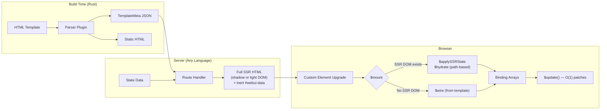
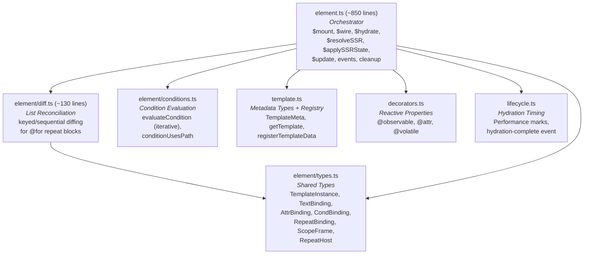
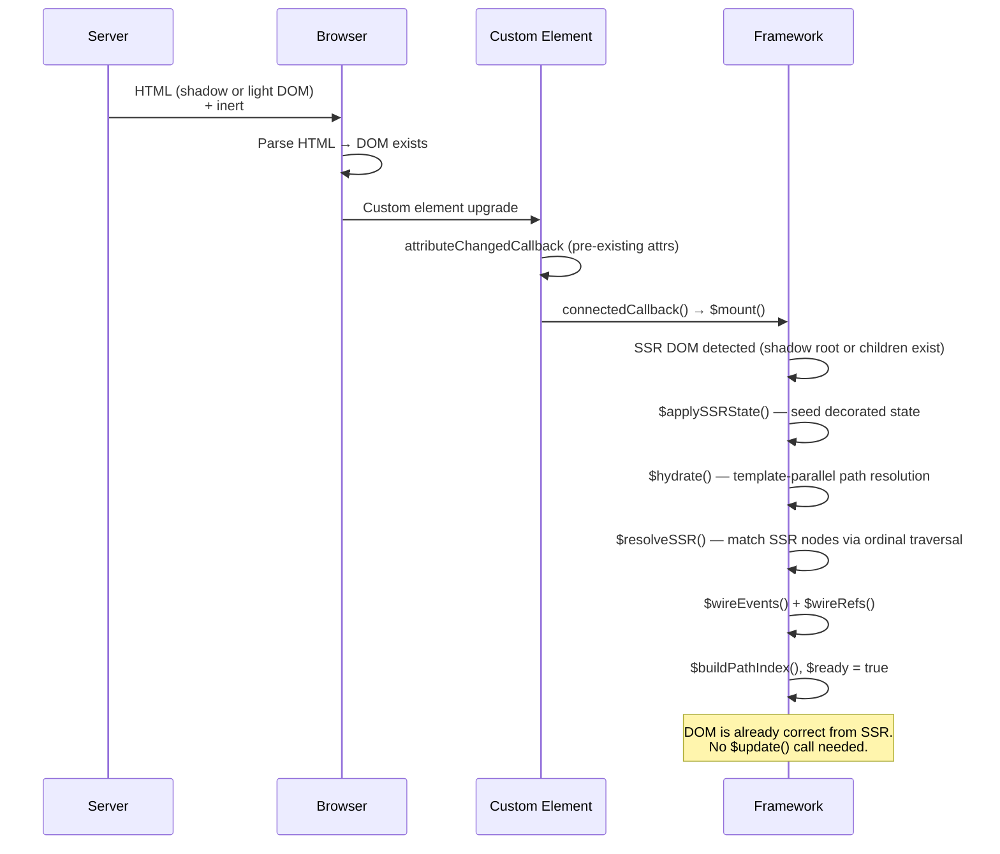
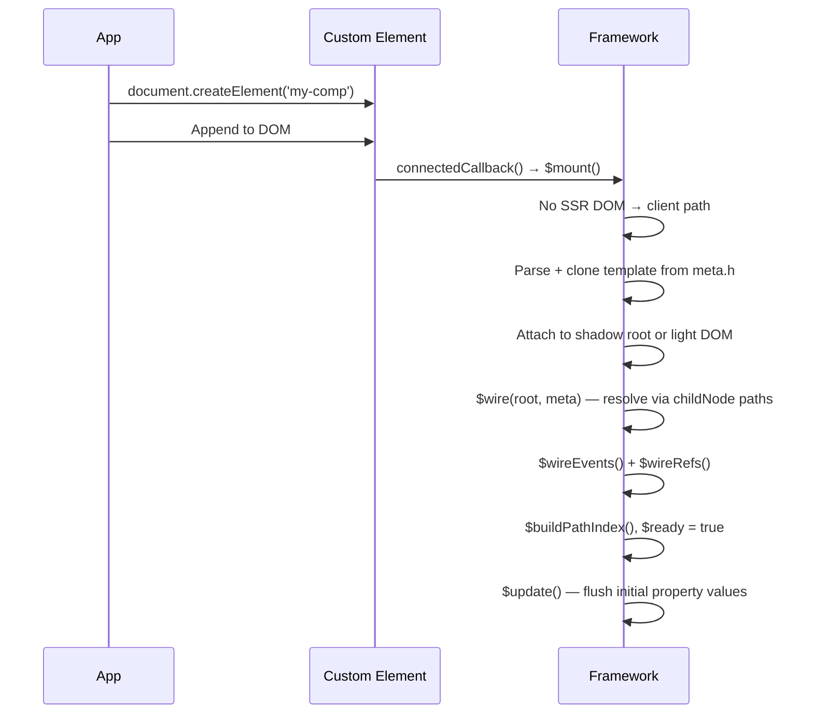
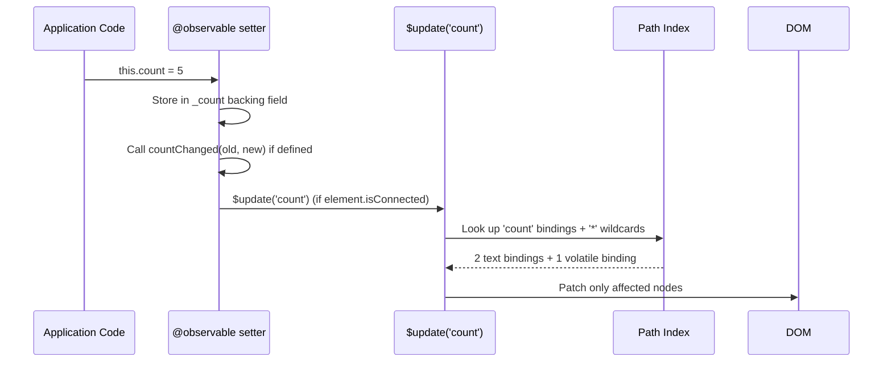
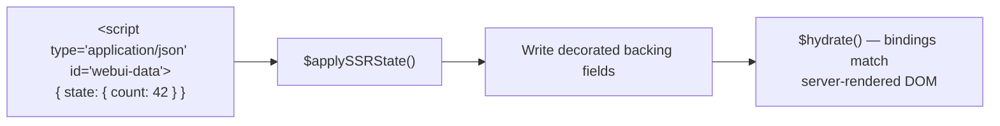
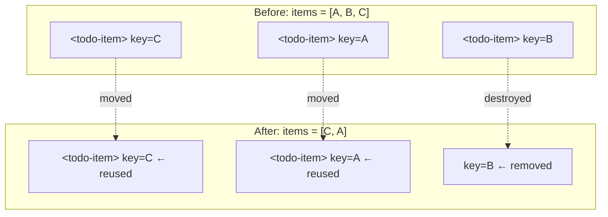

# `@microsoft/webui-framework`

Lightweight Web Component runtime for WebUI apps.

This package is the browser-side runtime used by `webui build --plugin=webui`. It provides:

- `WebUIElement` for SSR hydration and client-created elements
- `@observable`, `@attr`, and `@volatile` decorators
- direct DOM binding updates
- light DOM or shadow DOM rendering (`--dom=light|shadow` flag)
- SSR state seeding

If you are building WebUI apps in this repo, this is the component model used by examples like `examples/app/todo-webui`, `examples/app/commerce`, and `examples/app/contact-book-manager`.

> 📖 **Full documentation at [microsoft.github.io/webui](https://microsoft.github.io/webui)**, see the [Interactivity Guide](https://microsoft.github.io/webui/guide/concepts/interactivity) for component authoring patterns. For framework internals (hydration, path resolution, reactive update model), see [RENDERING.md](./RENDERING.md).

## Install

In this workspace:

```json
{
  "dependencies": {
    "@microsoft/webui-framework": "workspace:*"
  }
}
```

Outside the workspace:

```bash
pnpm add @microsoft/webui-framework
```

TypeScript must enable decorator emit:

```json
{
  "compilerOptions": {
    "experimentalDecorators": true,
    "useDefineForClassFields": false
  }
}
```

## Quick Example

1. Author a component class in TypeScript
2. Author a WebUI template in HTML
3. Run `webui build --plugin=webui`
4. The runtime hydrates SSR output or creates client-side components using compiled path mapping

### `counter-card.ts`

```ts
import { WebUIElement, attr, observable, volatile } from '@microsoft/webui-framework';

export class CounterCard extends WebUIElement {
  @attr label = 'Clicks';
  @observable count = 0;

  @volatile
  get doubled(): number {
    return this.count * 2;
  }

  increment(): void {
    this.count += 1;
  }
}

CounterCard.define('counter-card');
```

### `counter-card.html`

```html
<p>{{label}}: {{count}} ({{doubled}})</p>
<button @click="{increment()}">Increment</button>
```

Build with `--dom=shadow` (default) to wrap in a declarative shadow root, or `--dom=light` for light DOM rendering.

### Use it from your page

```html
<counter-card label="Taps"></counter-card>
```

### HTML-only dormant components

If a component has no event handlers, custom lifecycle code, or client-only
methods, it can ship only `component.html` and optional `component.css`.

The sibling `.ts` or `.js` file is the authored behavior boundary. With
manifest-enabled projection, only `@observable` and `@attr` fields opt into
initial state hydration; template-only roots stay in the trusted SSR DOM.
Without a module, template bindings render on the server and the component
contributes no projected keys. Without projection metadata, the server
preserves full state. The compiler still emits template metadata for scriptless
components. When the framework is loaded, it can activate that template when
browser state or client-side creation needs it.
If that first write omits a repeat collection, the host preserves the existing
SSR items until the collection is explicitly supplied.

Create a custom element only for an Interactive Island: event handlers, custom
lifecycle code, imperative methods, or state that TypeScript code reads or
mutates. `@observable` and `@attr` are optional; add them when JavaScript needs
to access the value or when the value is part of the component's public API.

### Build with the WebUI plugin

```bash
cargo run -p microsoft-webui-cli -- build ./src --out ./dist --plugin=webui
```

The WebUI plugin prepares component templates for the browser. Bundle your
source browser entry directly. Import `@microsoft/webui-framework` from authored
component modules. An app that stays static after SSR needs no framework
browser import. Import the framework once when HTML-only components must accept
browser state or participate in soft navigation.

The plugin alone preserves full server state. To emit exact `@observable` and
`@attr` state surfaces, run the application's bundler first with
`@microsoft/webui/projection.js`, then pass its manifest to `webui build` with
`--projection-manifest`. The manifest tooling is build-only; this runtime
package does not depend on esbuild or TypeScript.

### Property binding lifecycle

Property bindings use the `:` prefix to pass values directly to child DOM properties:

```html
<profile-card :config="{{settings}}"></profile-card>
```

For client-created component trees, WebUI applies initial property bindings
before child `connectedCallback` methods run. A child can read an initial
parent-provided property in `connectedCallback`. If the parent value is not set,
the child may initialize its own fallback there, and later parent updates still
flow through the live binding.

During SSR hydration the framework trusts the server-rendered DOM and does not
re-render it. An `@observable` written before hydration finishes — in a field
initializer, the `constructor`, or before `super.connectedCallback()` — cannot
update that DOM, so the write is dropped and the runtime logs a
`[WebUI] Hydration mismatch` warning naming the properties. Seed such values in
the SSR state, or assign them after `super.connectedCallback()`. The warning is
development-only and is dead-code-eliminated from production bundles via the
`__WEBUI_DEV__` compile-time flag (on by default; `webui-press build` sets it to
`false`). See the
[Interactivity Guide](https://microsoft.github.io/webui/guide/concepts/interactivity#setting-observable-state-during-setup).

### DOM strategy (`--dom`)

The `--dom` flag controls how the server renders component content:

| Flag | Behavior |
|------|----------|
| `--dom=shadow` (default) | Wraps component HTML in `<template shadowrootmode="open">` |
| `--dom=light` | Renders component content as direct children of the host element |

The runtime auto-detects which mode was used at hydration time:
- If a `shadowRoot` already exists → shadow DOM SSR path
- If `childNodes` exist but no shadow root → light DOM SSR path
- If neither → client-created path (uses `meta.sd` to decide)

Light DOM is useful for simpler styling (CSS inheritance works naturally) and
better search-engine indexing.  Shadow DOM provides style encapsulation.

---

## API Reference

### `WebUIElement`

Base class for framework components.

| Member | Purpose |
|--------|---------|
| `static define(tagName)` | Register the class as a custom element |
| `$emit(name, detail?)` | Dispatch a bubbling, composed `CustomEvent` |
| `$update()` | Force a reactive update (normally called automatically) |
| `disconnectedCallback()` | Override for cleanup (global listeners, etc.) |

In most components you do not call `$update()` directly. Property changes through `@observable` and `@attr` trigger updates for you.

### Static component assets

`webui build --plugin=webui --emit-component-assets settings-dialog` emits
`settings-dialog.webui.js` next to `protocol.bin`. Load the ESM asset before
creating the component when you are not using `@microsoft/webui-router`:

```ts
import { settingsAssets } from './lazy-assets.js';

settingsAssets.preload('settings-dialog');
panelSlot.replaceChildren(await settingsAssets.create('settings-dialog'));
```

```ts
// lazy-assets.ts
import { defineComponentAssets } from '@microsoft/webui-framework/component-asset.js';

export const settingsAssets = defineComponentAssets({
  'settings-dialog': {
    asset: '/settings-dialog.webui.js',
    module: () => import('./settings-dialog/settings-dialog.js'),
    data: async () => await (await fetch('/settings-dialog-data.json')).json(),
  },
});
```

The asset module carries the component's template and style payload. Use
`preload(tag)` to start template, module, and optional data work early, then
`create(tag)` to create the element after template/module work is ready.
Concurrent asset requests share one in-flight load and CSS module styles are
deduped. `create(tag)` does not block on optional data by default. Use
`create(tag, { awaitData: true, dataTimeoutMs: 150 })` only when a component must
wait briefly for state before mounting.

### `@observable`

Marks a property as reactive. When the value changes, the framework
updates template bindings that reference it. Use it for state that TypeScript
code reads or mutates. Values used only by the template do not need an
`@observable` class field.

```ts
class SearchPanel extends WebUIElement {
  @observable open = false;

  toggle(): void {
    this.open = !this.open;
  }
}
```

### `@attr`

Like `@observable` but also reflects to/from an HTML attribute (kebab-case).

```ts
class ProductPrice extends WebUIElement {
  @attr currency = 'USD';
  @attr({ attribute: 'amount-cents' }) amountCents = '0';
}
```

Notes:

- default attribute names use kebab-case
- attribute values arrive as strings
- during SSR hydration, an existing host attribute wins over projected state
- use `@observable` for state that client code reads or mutates

### `@volatile`

Marks a computed getter that should be re-read whenever bindings access it.

```ts
class CartSummary extends WebUIElement {
  @observable items: Array<{ count: number }> = [];

  @volatile
  get totalCount(): number {
    return this.items.reduce((sum, item) => sum + item.count, 0);
  }
}
```

## Template Features

The WebUI plugin supports these template features:

- text bindings: `{{title}}`
- attribute bindings: `href="{{item.href}}"`
- event handlers: `@click="{onClick()}"`, `@click="{onSelect(item.id, e)}"`
- refs: `w-ref="addInput"`
- conditionals: `<if condition="...">`
- repeats: `<for each="item in items">`

Components that use `@event` must have authored `.ts` or `.js` code that
defines a `WebUIElement` for the tag. HTML-only components do not provide
application event handlers.

Example from `examples/app/todo-webui`:

```html
<h1>{{title}}</h1>

<input
  class="add-input"
  w-ref="addInput"
  @keydown="{onAddKeydown(e)}"
/>

<for each="item in items">
  <todo-item
    id="{{item.id}}"
    title="{{item.title}}"
    state="{{item.state}}"
  ></todo-item>
</for>
```

Root-level events (e.g. `@toggle-item="{onToggleItem(e)}"`) can be declared on the component's host element and are wired via `meta.re`.

## Recommended Patterns

- Treat decorated properties as the source of truth for state used by
  TypeScript code.
- Update state with property assignments such as `this.open = !this.open`.
- Use `$emit()` for child-to-parent communication.
- Use `w-ref` for true DOM-only concerns like focus or reading input values.
- Omit `@observable` for values that are only read by the template and seeded
  externally after construction.
- Omit the TypeScript class when compiled template behavior is sufficient,
  including browser-applied state, route updates, and client-created instances.
  Add a same-named module only for authored events, lifecycle, decorators, or
  imperative APIs.

Avoid imperative DOM mutation for application state that can be represented by reactive properties.

---

## Performance Philosophy

This framework is designed for **minimal memory, minimal work, zero waste**.
Every design decision optimizes for real-world interactive performance on
resource-constrained devices.

### Design principles

1. **No work on the hot path that doesn't change the DOM.**
   `$update(path)` only visits bindings that reference the changed property.
   Everything else is skipped via a per-path index built once at hydration time.

2. **Zero allocations during updates.**
   Targeted updates are a single `Map.get()` → direct array iteration.
   No intermediate arrays, no object creation, no spread operators on the
   update path.

3. **Parse once, clone forever.**
   Compiled template HTML is parsed via `innerHTML` once per component tag
   and cached as a `DocumentFragment`.  Every subsequent instance uses
   `cloneNode(true)` — DOM cloning is significantly faster than HTML parsing.

4. **Resolve event targets once.**
   Event bindings store their target path in compiled metadata.  Hydration
   resolves each target once, installs the listener directly, and captures the
   active repeat scope so handler arguments like `item.id` are read at dispatch.

5. **Single-pass hydration via path mapping.**
   SSR DOM is matched to compiled template bindings through
   template-parallel traversal (`$resolveSSR`).  No marker comments, no
   data attributes — just path-based node resolution.  The hydration walk
   touches each DOM node exactly once.

6. **Keep the framework out of the GC's way.**
   Fewer JS objects = fewer GC pauses.  Binding arrays are pre-built at
   hydration time and reused across updates.  No per-update temporaries.

### Benchmark fixtures

The `tests/fixtures/bench/` directory contains Playwright-driven benchmarks
that validate these properties:

- **Update throughput**: 50k single-prop mutations with 65 bindings
- **Repeat instantiation**: 200 items created from compiled templates
- **Event memory**: 1000 event bindings measured via heap snapshots

Run benchmarks with:

```bash
cd packages/webui-framework
npx playwright test tests/fixtures/bench/
```

### What NOT to do

When contributing to the runtime, avoid these patterns:

- **Don't allocate on the update path.** No `[...spread]`, no `new Map()`,
  no object literals inside `$updateBindings` or `$updateInstance`.
- **Don't add `querySelector` calls during updates.** All DOM references are
  pre-resolved at hydration time via compiled path mapping.
- **Don't use recursion in hot paths.** Condition evaluation and DOM walks
  use iterative stacks.
- **Don't allocate on the update path for events.** Event listeners are created
  once during hydration and should not trigger extra DOM lookup work later.
- **Don't re-parse template HTML.** Always clone from the cached fragment.

---

## Architecture

### How It Fits Together

```
┌──────────────────────┐     ┌───────────────────────┐      ┌──────────────────────┐
│   Rust Compiler      │     │   Any Server          │      │   Browser            │
│                      │     │   (Rust/Go/C#/…)      │      │                      │
│  HTML template       │     │                       │      │  SSR HTML (light or  │
│  + expressions       │────▶│  TemplateMeta (JSON)  │────▶│  shadow DOM) +       │
│  + @if / @for        │     │  + state data         │      │  webui-data JSON     │
│                      │     │                       │      │                      │
│  Outputs:            │     │  Renders:             │      │  Hydrates:           │
│  • TemplateMeta      │     │  • Full HTML page     │      │  • Path-based DOM    │
│  • Static HTML       │     │  • Shadow or light    │      │    resolution        │
│  • Binding metadata  │     │  • State as JSON      │      │  • O(1) updates      │
└──────────────────────┘     └───────────────────────┘      └──────────────────────┘
```

**Key differentiator: language-agnostic SSR.**  React, Solid, Svelte, and
Angular all require a JavaScript runtime on the server.  This framework's SSR
is driven by data (template metadata + state values), not code.  Any language
that can read the compiled metadata and produce HTML can serve as the SSR
backend.  No comment markers or data attributes are needed — the runtime
resolves SSR DOM nodes via template-parallel path traversal.

### Build → Serve → Hydrate → Update



### Module Structure



---

## Lifecycle Detail

### SSR Hydration Path

When the server renders a component, it emits HTML content (as a declarative
shadow root or as light DOM children) along with an inert `#webui-data`
JSON payload.  The browser parses this DOM before any JavaScript runs.
When the component's JS loads and `connectedCallback` fires, the framework
uses compiled template paths to resolve SSR DOM nodes without any marker
comments or data attributes:



### Client-Created Path

When a component is created dynamically (e.g. inside a `@for` loop or via
`document.createElement`), there's no SSR DOM:



---

## Compiled Template Metadata

The Rust compiler transforms HTML templates into a `TemplateMeta` JSON object
that describes every dynamic binding without any template syntax.  This object
is delivered to the browser as a `<script>` tag.

### Metadata Shape

```typescript
interface TemplateMeta {
  h: string;                           // Static HTML (no markers)
  tx?: [slot, parts][];                // Text run locators
  a?: CompiledAttrMeta[];              // Attribute bindings
  ag?: [path, start, count][];         // Attribute target groups
  c?: [conditionAST, blockIndex, slot][]; // Conditional blocks
  r?: [collection, itemVar, blockIdx, slot][]; // Repeat blocks
  eg?: [event, [[handler, argSpecs, targetPath, usesEvent?]]][]; // Events
  b?: TemplateBlockMeta[];             // Nested block metadata
  sa?: string;                         // Adopted stylesheet specifier
  sd?: boolean;                        // Shadow DOM flag for client-created
  re?: [event, handler, argSpecs][];    // Root-level events
  tr?: string[];                       // Template state roots
  ta?: string[];                       // Host attributes aligned with tr
}
```

### Example

Template:
```html
<h1>{{title}}</h1>
<button @click="{increment()}">Count: {{count}}</button>
```

Compiled metadata:
```javascript
{
  h: '<h1></h1><button>Count: </button>',
  tx: [
    [[[0], 0], [["title"]]],           // slot in <h1>, dynamic "title"
    [[[1], 1], ["Count: ", ["count"]]]  // slot in <button>, static + dynamic
  ],
  eg: [["click", [["increment", [], [1]]]]] // click -> increment, no event args
}
```

### Condition references

Conditions are emitted as `[functionIndex, paths]` references. The index points
to a component-local closure in `window.__webui.templateFns[tagName]`, while
`paths` lets the runtime build targeted reactive indexes without parsing
function source.

The runtime normalizes each condition reference into `[fn, paths]` once before
hydration or client-created wiring, so hot update paths call the closure
directly.

---

## Reactive Update Model

### How `@observable` Triggers Updates



### Why Updates Are O(affected)

After hydration, every dynamic value in the template is connected to a direct
DOM node reference stored in a binding array. A per-path index maps each
decorated property or compiled template root to the subset of bindings that
reference it.

When `this.count = 5` fires, the `@observable` setter calls `$update('count')`,
which looks up `'count'` in the index and only patches the bindings that
actually depend on `count` — not every binding in the component.

Computed/volatile getters and other paths that are not known state roots are
stored under a wildcard key and always included in targeted updates.

```typescript
// Targeted update (simplified):
const entry = this.$pathIndex.get(path);  // O(1) map lookup
const wild = this.$pathIndex.get('*');     // volatile/computed bindings
// Only walk affected bindings, not all 65+
for (const binding of [...entry.texts, ...wild.texts]) {
  if (binding.node.textContent !== str) {
    binding.node.textContent = str;  // Direct Text node reference
  }
}
```

No virtual DOM diffing.  No selector queries.  No tree walking.  Each binding
is a pre-resolved pointer to the exact DOM node that needs updating, and the
path index ensures only affected pointers are visited.

---

## SSR State Seeding

When the server renders `<span>42</span>` for a template binding, the browser
sees `42` in the DOM before the component's JavaScript state exists. Without
seeding, the first `$update()` would overwrite the SSR content with the wrong
value.

State seeding uses `window.__webui.state` loaded from the server-emitted
`#webui-data` block. When the protocol contains projection metadata, only
`@observable` and `@attr` keys from reachable authored components select
initial state; HTML-only dormant components and authored template-only roots
contribute no startup keys. Without projection metadata, the server preserves
full state. During `$mount()`, `$applySSRState()` writes matching decorated keys
directly to observable backing fields before any bindings are wired:



Decorated writes go to the backing field (`_prop`) directly, avoiding reactive
updates before bindings are wired. For `@attr`, an existing SSR host attribute
takes precedence and the projected value is skipped. Template-only values
remain represented by the SSR DOM until browser state explicitly changes them.
Later `setState()` calls, including router partials, accept both decorated
properties and compiled template roots; undecorated roots are stored in hidden
framework state. The first write to a dormant HTML-only host replays only the
roots present in that write, preserving omitted SSR text, attributes,
conditions, and repeats.

---

## Repeat Reconciliation

`@for(item of items)` blocks support two reconciliation strategies,
implemented in `element/diff.ts` (~130 lines):

### Keyed Reconciliation

When the repeat block's root element has attribute bindings (e.g.
`<todo-item id="{{item.id}}">`), the framework uses the first attribute as a
key.  This preserves DOM nodes across reorders:



### Sequential Reconciliation

When no keying attributes exist, items are matched by position.  Excess items
are removed; new items are appended.

### SSR State Reading

On initial hydration, the repeat system walks existing SSR children and
reconstructs collection instances by matching them against the compiled
template via `$resolveSSR` path traversal.  State is already seeded from
`window.__webui.state`, so repeat items reflect the server-rendered list
without parsing marker comments.

---

## CSS Strategies

The framework supports three CSS delivery strategies:

| Strategy | How it works |
|----------|-------------|
| **Link** | `<link>` tag baked into `meta.h` — loaded by the browser naturally |
| **Inline** | `<style>` tag baked into `meta.h` — no external request |
| **Module** | `<script type="importmap">{"imports":{"tag-name":"data:text/css,..."}}</script>` in the HTML payload registers the CSS as a module under `tag-name`. The framework imports it via `import(tag, { with: { type: 'css' } })` and applies the resulting `CSSStyleSheet` via `adoptedStyleSheets` for shadow DOM isolation |

CSS module stylesheets are cached so each component instance adopts the same
parsed sheet without re-parsing CSS.  The `meta.sa` field specifies the
stylesheet specifier for a component.

---

## Path-Based Binding Resolution

Unlike frameworks that use comment markers or data attributes to locate
dynamic content, this framework uses **compiled template paths** — arrays of
child-node indices that describe exactly where each binding lives in the DOM
tree.

### Client-created resolution (`$resolve`)

For client-created components, the DOM matches `meta.h` exactly (it was cloned
from the parsed template fragment).  Resolution is a simple child-node index
walk:

```typescript
// path = [1, 0] → root.childNodes[1].childNodes[0]
let cur: Node = root;
for (const idx of path) {
  cur = cur.childNodes[idx];
}
```

### SSR resolution (`$resolveSSR`)

SSR DOM may differ from the compiled template — the browser's HTML parser can
strip whitespace-only text nodes.  `$resolveSSR` walks the SSR DOM and the
compiled template DOM **in parallel**, translating each child-node index into
an element-ordinal or text-ordinal lookup:

```typescript
// For element nodes: count element siblings up to idx in template,
// then find the element at that ordinal in SSR DOM.
// For text nodes: same approach with text node ordinals.
```

This template-parallel traversal eliminates the need for any marker comments,
`data-*` attributes, or DOM annotations.  The SSR server emits clean HTML.

---

## Performance Characteristics

| Operation | Cost | Why |
|-----------|------|-----|
| Initial hydration | O(bindings) | Single pass over compiled path mappings |
| Reactive update | O(affected) | Per-path index skips unrelated bindings |
| Conditional toggle | O(block size) | Create/destroy a block instance |
| Repeat reconciliation | O(items) | Keyed map lookup or sequential scan |
| Event wiring | O(events) | One-time during hydration |

### What the framework does NOT do

- **No virtual DOM** — no tree copy, no diff algorithm
- **No runtime template parsing** — the Rust compiler handles all syntax
- **No `innerHTML` on updates** — only `textContent` and `setAttribute`
- **No `querySelector` on updates** — all nodes are pre-resolved references
- **No recursion in hot paths** — conditions use iterative stack evaluation

---

## Debugging Hydration

The runtime exposes hydration timing via the Performance API:

- Per component: `webui:hydrate:<tag>:start` / `webui:hydrate:<tag>:end`
- Global: `webui:hydrate:total:start` / `webui:hydrate:total:end`
- Window event: `webui:hydration-complete`

```ts
window.addEventListener('webui:hydration-complete', () => {
  console.log('All initial framework components are hydrated.');
});
```

---

## Where to Look Next

- `examples/app/todo-webui`
- `examples/app/contact-book-manager`
- `examples/app/commerce`

## Package Development

```bash
pnpm --dir packages/webui-framework build
pnpm --dir packages/webui-framework typecheck
pnpm --dir packages/webui-framework test
```
