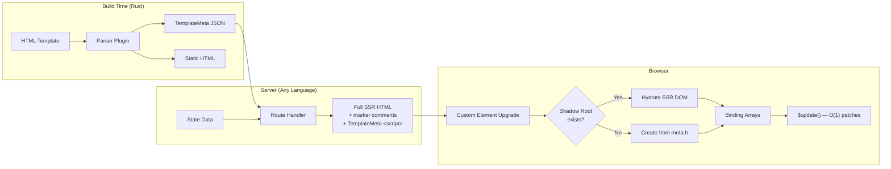
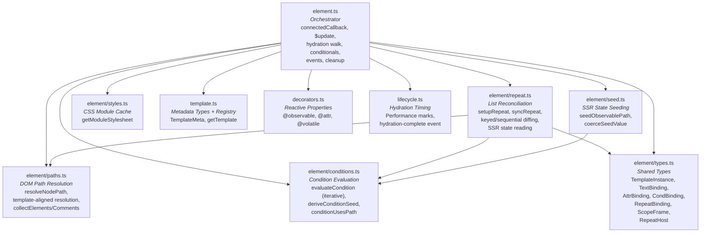
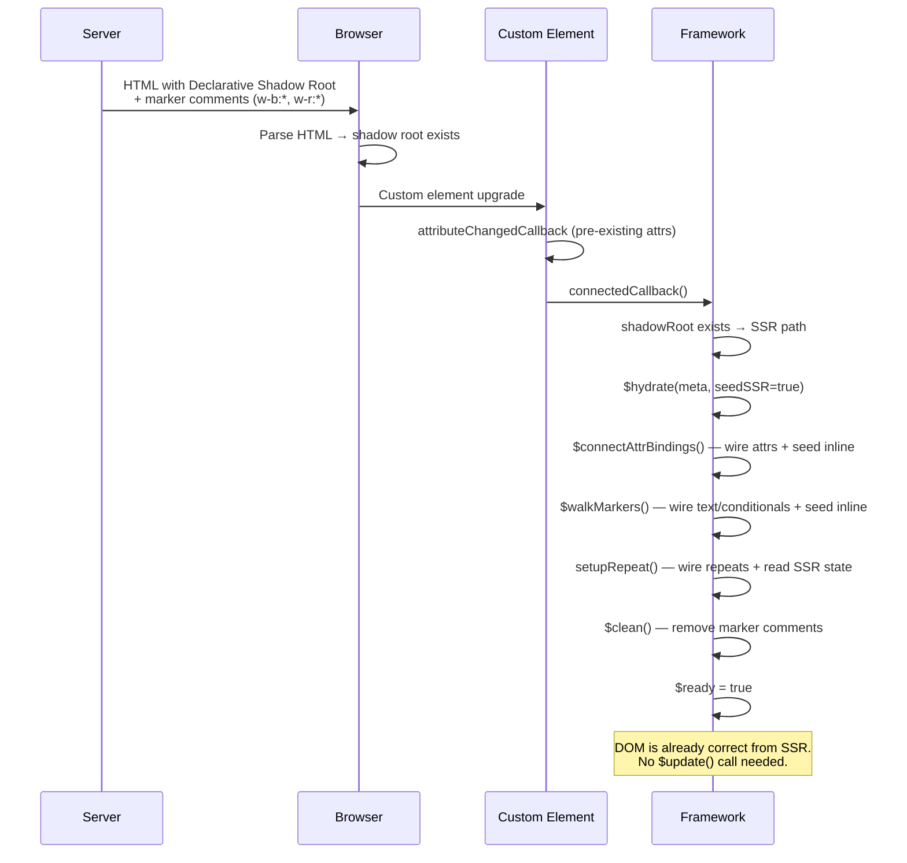
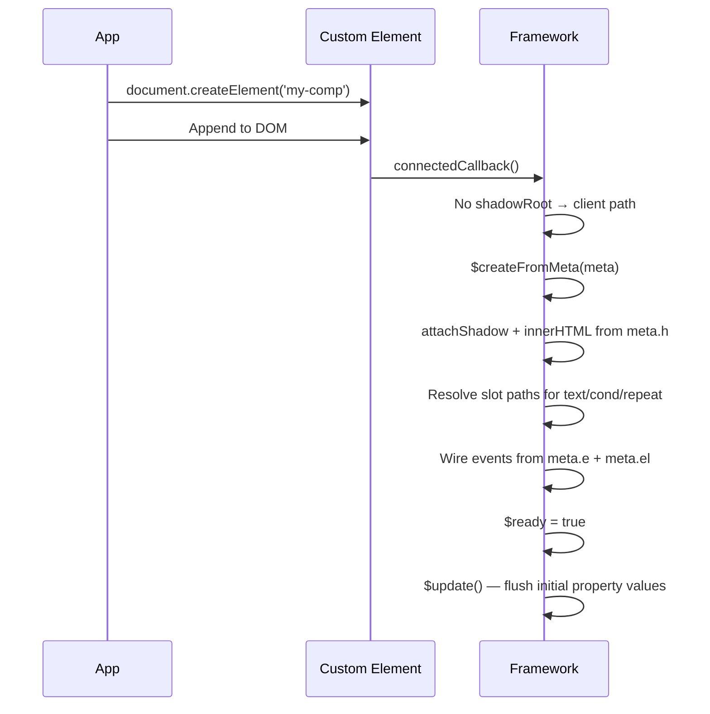
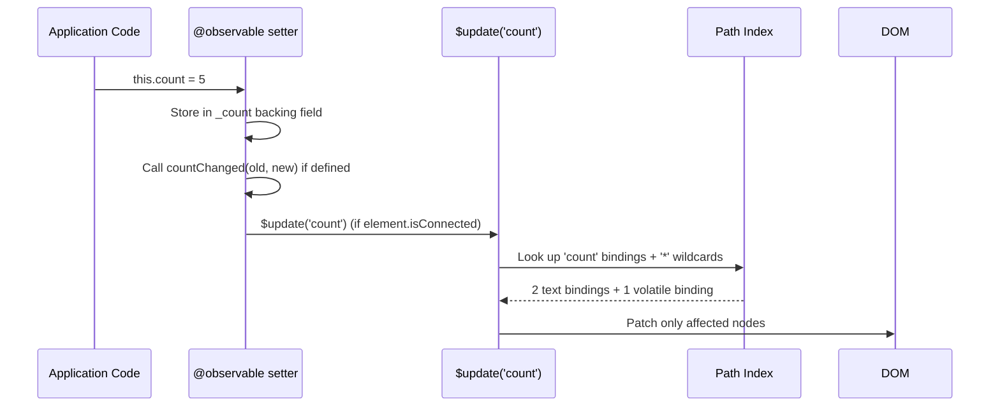
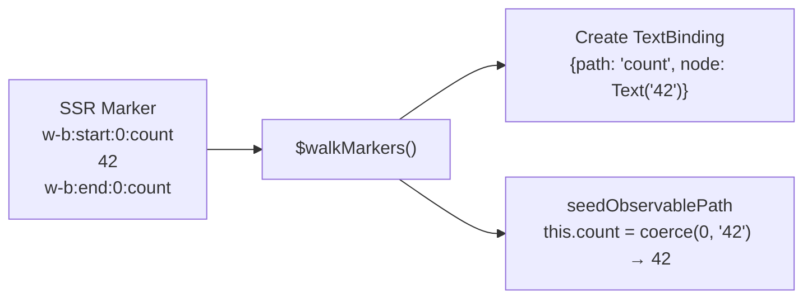
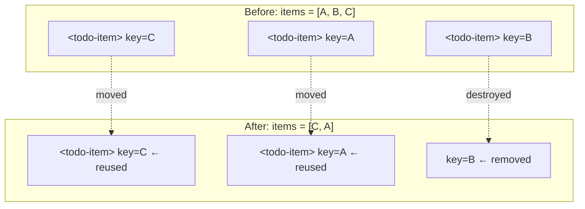

# `@microsoft/webui-framework`

Lightweight Web Component runtime for WebUI apps.

This package is the browser-side runtime used by `webui build --plugin=webui`. It provides:

- `WebUIElement` for SSR hydration and client-created elements
- `@observable`, `@attr`, and `@volatile` decorators
- direct DOM patching from compiler-generated template metadata
- built-in hydration lifecycle tracking

If you are building WebUI apps in this repo, this is the component model used by examples like `examples/app/todo-webui`, `examples/app/commerce`, and `examples/app/contact-book-manager`.

## Install

In this workspace:

```json
{
  "dependencies": {
    "@microsoft/webui-framework": "workspace:*"
  }
}
```

Outside the workspace:

```bash
pnpm add @microsoft/webui-framework
```

TypeScript must use legacy decorators:

```json
{
  "compilerOptions": {
    "experimentalDecorators": true,
    "useDefineForClassFields": false
  }
}
```

## Quick Example

1. Author a component class in TypeScript
2. Author a WebUI template in HTML
3. Run `webui build --plugin=webui`
4. The runtime hydrates SSR output or instantiates client-created components from generated metadata

### `counter-card.ts`

```ts
import { WebUIElement, attr, observable, volatile } from '@microsoft/webui-framework';

export class CounterCard extends WebUIElement {
  @attr label = 'Clicks';
  @observable count = 0;

  @volatile
  get doubled(): number {
    return this.count * 2;
  }

  increment(): void {
    this.count += 1;
  }
}

CounterCard.define('counter-card');
```

### `counter-card.html`

```html
<template shadowrootmode="open">
  <p>{{label}}: {{count}} ({{doubled}})</p>
  <button @click="{increment()}">Increment</button>
</template>
```

### Use it from your page

```html
<counter-card label="Taps"></counter-card>
```

### Build with the WebUI plugin

```bash
cargo run -p microsoft-webui-cli -- build ./src --out ./dist --plugin=webui
```

The compiler/plugin generates the template metadata consumed by the runtime. In normal app code, you should not need to hand-author `window.__webui_templates`.

---

## API Reference

### `WebUIElement`

Base class for framework components.

| Member | Purpose |
|--------|---------|
| `static define(tagName)` | Register the class as a custom element |
| `$emit(name, detail?)` | Dispatch a bubbling, composed `CustomEvent` |
| `$update()` | Force a reactive update (normally called automatically) |
| `setInitialState(state, params?)` | Populate `@observable` properties from router state |
| `disconnectedCallback()` | Override for cleanup (global listeners, etc.) |

In most components you do not call `$update()` directly. Property changes through `@observable` and `@attr` trigger updates for you.

### `@observable`

Marks a property as reactive.  When the value changes, the framework
re-evaluates the compiled bindings that reference it.

```ts
class SearchPanel extends WebUIElement {
  @observable open = false;

  toggle(): void {
    this.open = !this.open;
  }
}
```

### `@attr`

Like `@observable` but also reflects to/from an HTML attribute (kebab-case).

```ts
class ProductPrice extends WebUIElement {
  @attr currency = 'USD';
  @attr({ attribute: 'amount-cents' }) amountCents = '0';
}
```

Notes:

- default attribute names use kebab-case
- attribute values arrive as strings
- use `@observable` for richer client-only state

### `@volatile`

Marks a computed getter that should be re-read whenever bindings access it.

```ts
class CartSummary extends WebUIElement {
  @observable items: Array<{ count: number }> = [];

  @volatile
  get totalCount(): number {
    return this.items.reduce((sum, item) => sum + item.count, 0);
  }
}
```

## Template Features

The WebUI plugin compiles these template features into runtime metadata:

- text bindings: `{{title}}`
- attribute bindings: `href="{{item.href}}"`
- event handlers: `@click="{onClick()}"`
- refs: `w-ref="addInput"`
- conditionals: `<if condition="...">`
- repeats: `<for each="item in items">`

Example from `examples/app/todo-webui`:

```html
<template shadowrootmode="open"
  @toggle-item="{onToggleItem(e)}"
  @delete-item="{onDeleteItem(e)}"
>
  <h1>{{title}}</h1>

  <input
    class="add-input"
    w-ref="addInput"
    @keydown="{onAddKeydown(e)}"
  />

  <for each="item in items">
    <todo-item
      id="{{item.id}}"
      title="{{item.title}}"
      state="{{item.state}}"
    ></todo-item>
  </for>
</template>
```

## Recommended Patterns

- Treat decorated properties as the source of truth.
- Update state with property assignments such as `this.open = !this.open`.
- Use `$emit()` for child-to-parent communication.
- Use `w-ref` for true DOM-only concerns like focus or reading input values.
- Prefer `@observable someValue!: T;` when a value is expected to be seeded externally after construction.

Avoid imperative DOM mutation for application state that can be represented by reactive properties.

---

## Performance Philosophy

This framework is designed for **minimal memory, minimal work, zero waste**.
Every design decision optimizes for real-world interactive performance on
resource-constrained devices.

### Design principles

1. **No work on the hot path that doesn't change the DOM.**
   `$update(path)` only visits bindings that reference the changed property.
   Everything else is skipped via a per-path index built once at hydration time.

2. **Zero allocations during updates.**
   Targeted updates are a single `Map.get()` → direct array iteration.
   No intermediate arrays, no object creation, no spread operators on the
   update path.

3. **Parse once, clone forever.**
   Compiled template HTML is parsed via `innerHTML` once per component tag
   and cached as a `DocumentFragment`.  Every subsequent instance uses
   `cloneNode(true)` — DOM cloning is significantly faster than HTML parsing.

4. **Delegate events, don't multiply listeners.**
   Event bindings use delegation: one listener per event type on the shadow
   root, with handler names stored as data attributes.  200 items × 5 events
   = 1 delegated listener, not 1000 closures.

5. **Single-pass hydration.**
   SSR state seeding happens inline during the marker walk — not in a
   separate pass.  The hydration walk touches each DOM node exactly once.

6. **Keep the framework out of the GC's way.**
   Fewer JS objects = fewer GC pauses.  Binding arrays are pre-built at
   hydration time and reused across updates.  No per-update temporaries.

### Benchmark fixtures

The `tests/fixtures/bench/` directory contains Playwright-driven benchmarks
that validate these properties:

- **Update throughput**: 50k single-prop mutations with 65 bindings
- **Repeat instantiation**: 200 items created from compiled templates
- **Event memory**: 1000 event bindings measured via heap snapshots

Run benchmarks with:

```bash
cd packages/webui-framework
npx playwright test tests/fixtures/bench/
```

### What NOT to do

When contributing to the runtime, avoid these patterns:

- **Don't allocate on the update path.** No `[...spread]`, no `new Map()`,
  no object literals inside `$updateBindings` or `$updateInstance`.
- **Don't add `querySelector` calls during updates.** All DOM references are
  pre-resolved at hydration time.
- **Don't use recursion in hot paths.** Condition evaluation and DOM walks
  use iterative stacks.
- **Don't create closures per binding.** Use delegation or shared handlers.
- **Don't re-parse template HTML.** Always clone from the cached fragment.

---

## Architecture

### How It Fits Together

```
┌──────────────────────┐     ┌───────────────────────┐      ┌──────────────────────┐
│   Rust Compiler      │     │   Any Server          │      │   Browser            │
│                      │     │   (Rust/Go/C#/…)      │      │                      │
│  HTML template       │     │                       │      │  SSR HTML + markers  │
│  + expressions       │────▶│  TemplateMeta (JSON)  │────▶│  + <script> with     │
│  + @if / @for        │     │  + state data         │      │    TemplateMeta      │
│                      │     │                       │      │                      │
│  Outputs:            │     │  Renders:             │      │  Hydrates:           │
│  • TemplateMeta      │     │  • Full HTML page     │      │  • Connects bindings │
│  • Static HTML       │     │  • Marker comments    │      │  • Seeds state       │
│  • Binding metadata  │     │  • Declarative Shadow │      │  • O(1) updates      │
└──────────────────────┘     └───────────────────────┘      └──────────────────────┘
```

**Key differentiator: language-agnostic SSR.**  React, Solid, Svelte, and
Angular all require a JavaScript runtime on the server.  This framework's SSR
is driven by data (template metadata + state values), not code.  Any language
that can read the compiled metadata and produce HTML with marker comments can
serve as the SSR backend.

### Build → Serve → Hydrate → Update



### Module Structure



---

## Lifecycle Detail

### SSR Hydration Path

When the server renders a component, it emits a Declarative Shadow Root with
hydration markers.  The browser parses this as a real shadow root before any
JavaScript runs.  When the component's JS loads and `connectedCallback` fires,
the framework walks the existing DOM once to connect bindings:



### Client-Created Path

When a component is created dynamically (e.g. inside a `@for` loop or via
`document.createElement`), there's no SSR DOM:



---

## Compiled Template Metadata

The Rust compiler transforms HTML templates into a `TemplateMeta` JSON object
that describes every dynamic binding without any template syntax.  This object
is delivered to the browser as a `<script>` tag.

### Metadata Shape

```typescript
interface TemplateMeta {
  h: string;                           // Marker-free static HTML
  tx?: [slot, parts][];                // Text run locators
  a?: CompiledAttrMeta[];              // Attribute bindings
  ag?: [path, start, count][];         // Attribute target groups
  c?: [conditionAST, blockIndex][];    // Conditional blocks
  cl?: SlotPath[];                     // Conditional anchor slots
  r?: [collection, itemVar, blockIdx][];// Repeat blocks
  rl?: SlotPath[];                     // Repeat anchor slots
  e?: [event, handler, needsEvent][];  // Events
  el?: NodePath[];                     // Event target paths
  b?: TemplateBlockMeta[];             // Nested block metadata
  sa?: string;                         // Adopted stylesheet specifier
  re?: [event, handler, needsEvent][];  // Root-level events
}
```

### Example

Template:
```html
<h1>{{title}}</h1>
<button @click="increment">Count: {{count}}</button>
```

Compiled metadata:
```javascript
{
  h: '<h1></h1><button>Count: </button>',
  tx: [
    [[[0], 0], [["title"]]],           // slot in <h1>, dynamic "title"
    [[[1], 1], ["Count: ", ["count"]]]  // slot in <button>, static + dynamic
  ],
  e: [["click", "increment", 0]],      // click → increment, no event arg
  el: [[1]]                            // event target is child[1] (button)
}
```

### Condition AST

Conditions are emitted as compact tuples:

| Tuple | Meaning | Example |
|-------|---------|---------|
| `[0, path]` | Identifier (truthy check) | `@if(visible)` |
| `[1, left, op, right]` | Comparison predicate | `@if(count > 0)` |
| `[2, inner]` | Logical NOT | `@if(!visible)` |
| `[3, left, op, right]` | Compound AND/OR | `@if(a && b)` |

The runtime evaluates these iteratively (stack-based, no recursion) to avoid
call-stack depth in hot update paths.

---

## Reactive Update Model

### How `@observable` Triggers Updates



### Why Updates Are O(affected)

After hydration, every dynamic value in the template is connected to a direct
DOM node reference stored in a binding array.  A per-path index maps each
`@observable` property name to the subset of bindings that reference it.

When `this.count = 5` fires, the `@observable` setter calls `$update('count')`,
which looks up `'count'` in the index and only patches the bindings that
actually depend on `count` — not every binding in the component.

Computed/volatile getters (paths not in the `@observable` set) are stored
under a wildcard key and always included in targeted updates.

```typescript
// Targeted update (simplified):
const entry = this.$pathIndex.get(path);  // O(1) map lookup
const wild = this.$pathIndex.get('*');     // volatile/computed bindings
// Only walk affected bindings, not all 65+
for (const binding of [...entry.texts, ...wild.texts]) {
  if (binding.node.textContent !== str) {
    binding.node.textContent = str;  // Direct Text node reference
  }
}
```

No virtual DOM diffing.  No selector queries.  No tree walking.  Each binding
is a pre-resolved pointer to the exact DOM node that needs updating, and the
path index ensures only affected pointers are visited.

---

## SSR State Seeding

When the server renders `<span>42</span>` for `@observable count = 0`, the
browser sees `42` in the DOM but the JavaScript property `this.count` is still
`0` (the class default).  Without seeding, the first `$update()` would
overwrite the SSR content with the wrong value.

Seeding happens inline during the hydration walk — not in a separate pass.
As `$walkMarkers` discovers each text binding, it reads the DOM value and
writes it to the backing property:



The `coerceSeedValue` function ensures type fidelity:
- `@observable count = 0` + DOM `"42"` → seeds as `42` (number)
- `@observable active = false` + DOM `"true"` → seeds as `true` (boolean)
- `@observable title = ''` + DOM `"Hello"` → seeds as `"Hello"` (string)

---

## Repeat Reconciliation

`@for(item of items)` blocks support two reconciliation strategies:

### Keyed Reconciliation

When the repeat block's root element has attribute bindings (e.g.
`<todo-item id="{{item.id}}">`), the framework uses the first attribute as a
key.  This preserves DOM nodes across reorders:



### Sequential Reconciliation

When no keying attributes exist, items are matched by position.  Excess items
are removed; new items are appended.

### SSR State Reading

On initial hydration, `readRepeatFromDOM` walks existing SSR children and
reconstructs the collection array by reading text markers and attribute values
from each child element.  This means `@observable items` reflects the
server-rendered list without any JSON serialization.

---

## CSS Strategies

The framework supports three CSS delivery strategies:

| Strategy | How it works |
|----------|-------------|
| **Link** | `<link>` tag baked into `meta.h` — loaded by the browser naturally |
| **Inline** | `<style>` tag baked into `meta.h` — no external request |
| **Module** | `<style type="module" specifier="tag-name">` in the HTML payload, parsed into a `CSSStyleSheet` and applied via `adoptedStyleSheets` for shadow DOM isolation |

The `styles.ts` module caches constructable stylesheets so each component
instance adopts the same parsed sheet without re-parsing CSS.

---

## Hydration Markers

SSR HTML contains comment markers that the runtime uses to locate dynamic
content during the one-time hydration walk:

| Marker | Purpose |
|--------|---------|
| `<!--w-b:start:N:path-->...<!--w-b:end:N:path-->` | Text binding — wraps dynamic text content |
| `<!--w-b:start:N:if-M-->...<!--w-b:end:N:if-M-->` | Conditional block — wraps `@if` content |
| `<!--w-r:start:N-->...<!--w-r:end:N-->` | Repeat boundary — wraps `@for` children |
| `data-w-b-N` / `data-w-c-N-M` | Attribute binding markers on elements |
| `data-ev="N"` | Event target marker |

After hydration, all markers are removed from the DOM by `$clean()`.  The
runtime only uses them once — after that, all updates go through direct binding
references.

---

## Performance Characteristics

| Operation | Cost | Why |
|-----------|------|-----|
| Initial hydration | O(markers) | Single pass over SSR comments + attribute markers |
| Reactive update | O(affected) | Per-path index skips unrelated bindings |
| Conditional toggle | O(block size) | Create/destroy a block instance |
| Repeat reconciliation | O(items) | Keyed map lookup or sequential scan |
| Event wiring | O(events) | One-time during hydration |

### What the framework does NOT do

- **No virtual DOM** — no tree copy, no diff algorithm
- **No runtime template parsing** — the Rust compiler handles all syntax
- **No `innerHTML` on updates** — only `textContent` and `setAttribute`
- **No `querySelector` on updates** — all nodes are pre-resolved references
- **No recursion in hot paths** — conditions use iterative stack evaluation

---

## Debugging Hydration

The runtime exposes hydration timing via the Performance API:

- Per component: `webui:hydrate:<tag>:start` / `webui:hydrate:<tag>:end`
- Global: `webui:hydrate:total:start` / `webui:hydrate:total:end`
- Window event: `webui:hydration-complete`

```ts
window.addEventListener('webui:hydration-complete', () => {
  console.log('All initial framework components are hydrated.');
});
```

---

## Where to Look Next

- `examples/app/todo-webui`
- `examples/app/contact-book-manager`
- `examples/app/commerce`

## Package Development

```bash
pnpm --dir packages/webui-framework build
pnpm --dir packages/webui-framework typecheck
pnpm --dir packages/webui-framework test
```
