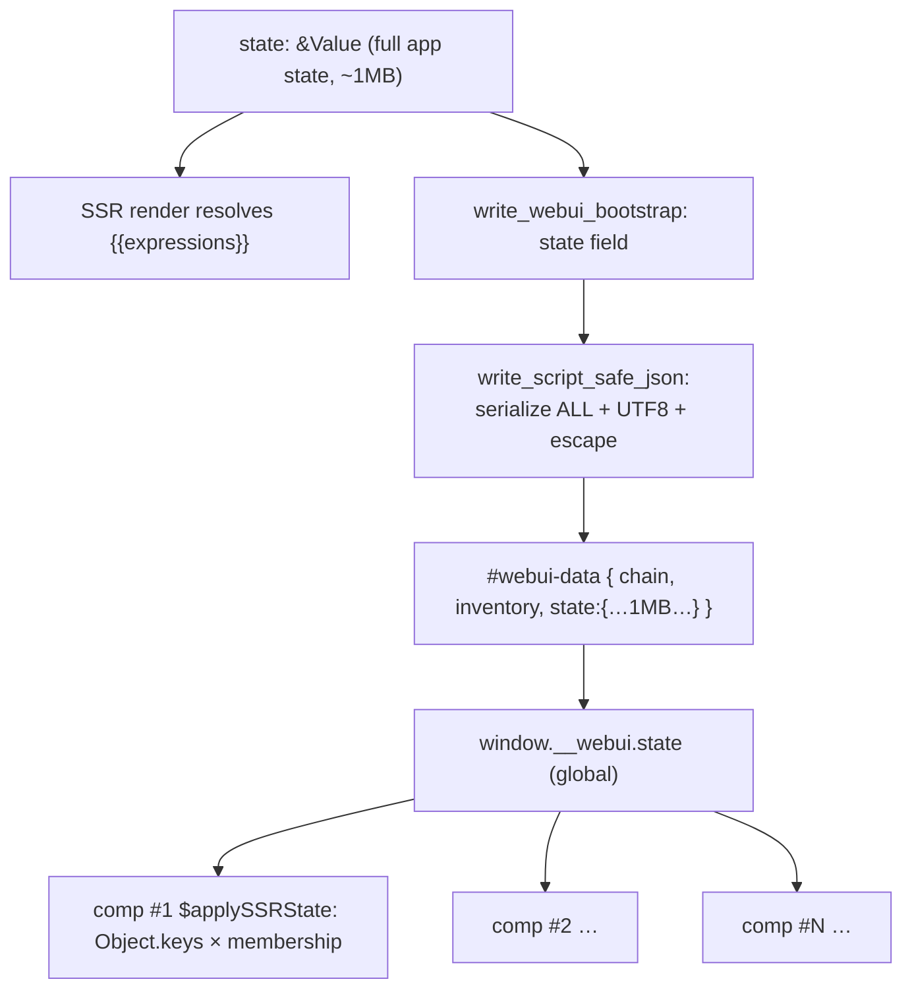
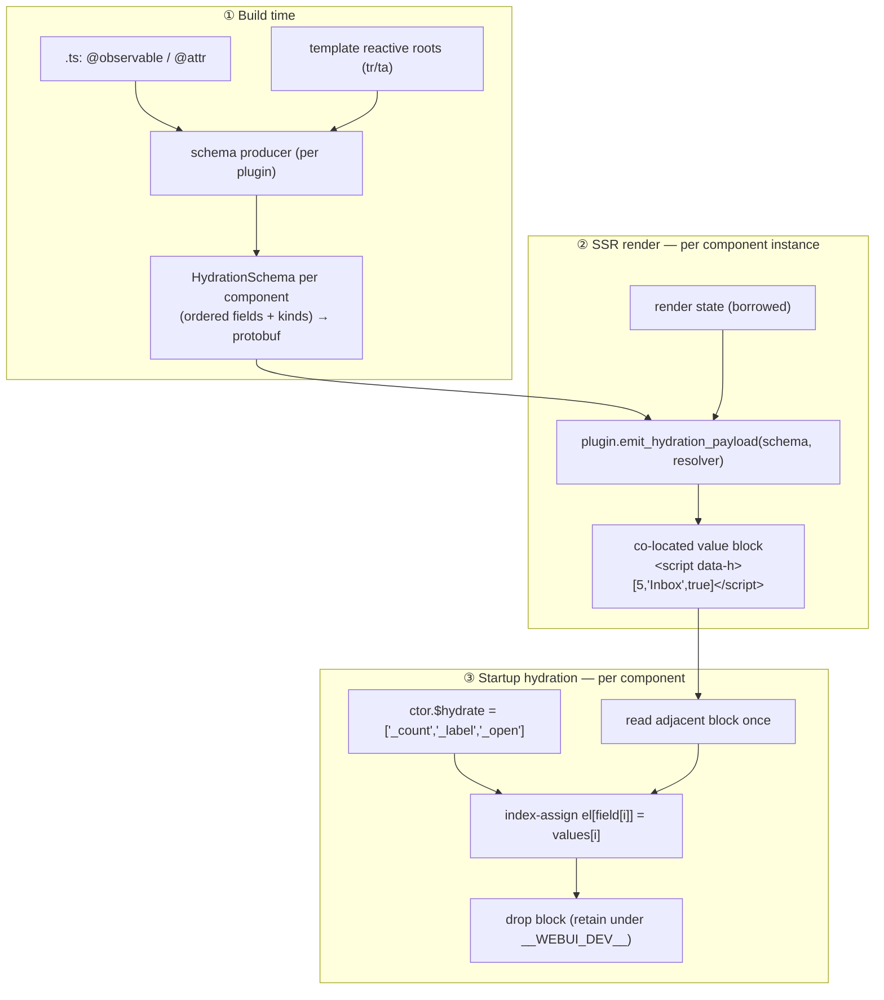

# RFC: Plugin-Centric Per-Component Hydration Schema

**Status:** Proposal · **Author:** session `Handler state emission` · **Scope:** `webui-protocol`, `webui-handler`, `webui-discovery`/`webui-press`, `webui-framework`, `webui-router`
**Breaking:** Yes — no backwards compatibility. The monolithic `#webui-data` `state` field is removed.

---

## 1. Summary

Replace the single monolithic `<script id="webui-data">…"state":{…}</script>` block — which serializes the **entire** application state as one JSON string at render time — with **per-component, plugin-produced hydration payloads** co-located with each component instance in the SSR DOM.

Each plugin owns a **hydration schema** compiled at build time (from `.ts` `@observable`/`@attr` decorators unioned with template reactive roots). At render time the handler walks that schema and emits a compact **positional value block** next to each component. The client hydrates by index-assigning backing fields, then drops the block.

The core shift: **the compiled schema *is* the allowlist.** Server-only fields never enter any schema, so they are never serialized. Hydration cost drops from `O(N·K)` (N instances re-scanning a K-key global bag) to `O(total hydrated fields)`.

---

## 2. Motivation

### 2.1 The measured hot path

Today, full-HTML SSR emits one consolidated block. The `state` field is written by `write_webui_bootstrap` (`crates/webui-handler/src/lib.rs:411`) through `write_script_safe_json` (`lib.rs:309`):

```rust
// lib.rs:309 — current monolithic serialization
let mut json = Vec::with_capacity(256);
serde_json::to_writer(&mut json, value)?;          // ① serialize ENTIRE state
let json = std::str::from_utf8(&json)?;            // ② full UTF-8 re-validation
write_script_safe_json_str(writer, json)?;         // ③ second pass: scan for </
```

For a ~1 MB state this is three linear passes over ~1 MB (grow-and-realloc serialize, UTF‑8 validate, `</`-escape scan), **regardless of how little of that state is actually hydrated**. This is the reported CPU spike at startup.

### 2.2 The client mirror of the same waste

`$applySSRState` (`packages/webui-framework/src/template-element.ts:596`) reads the **global** `window.__webui.state`, calls `Object.keys(state)`, and for **every** key checks `$observableNames()` + template roots — **once per component instance**:

```
N instances × Object.keys(K-key state) × membership checks  →  O(N·K)
```

Both server and client pay for data that is mostly not hydrated.

### 2.3 Guiding principle

> **Move the decision to build/startup, apply zero-copy at runtime.**

The set of hydratable fields per component is statically knowable at build time. The runtime should ship and assign only *values*, in a pre-agreed order, with no scanning, no filtering, and no monolithic serialization.

---

## 3. Goals / Non-Goals

**Goals**
- Eliminate whole-state JSON serialization on the SSR hot path.
- Plugin-centric: **any** plugin produces its own hydration schema and wire format; the handler never interprets it.
- Reuse the existing `prost`/protobuf pipeline for the schema (no ad-hoc side channel).
- Reduce client hydration to `O(total hydrated fields)` with monomorphic index-assign.
- Server-only fields are structurally impossible to leak (not in any schema).
- Add a ~1 MB state benchmark that gates regressions.

**Non-Goals**
- Backwards compatibility. `window.__webui.state` and the monolithic `state` field are deleted.
- Changing the router **chain / inventory / nonce** contract (those stay in a demoted shared block).
- Reworking template metadata (`template_json` / `templateFns`) delivery — orthogonal.

---

## 4. Current Architecture (baseline)



Ownership today: host supplies `state` content; **handler** manufactures the block and serializes the whole thing; **every** client component re-scans the global bag.

---

## 5. Proposed Architecture



### 5.1 Responsibility split (new)

| Concern | Owner |
|---|---|
| Which fields are hydratable (schema) | **Plugin schema producer** at build time |
| Schema storage / transport | **protobuf** (`ComponentData.hydration`) |
| Per-instance wire format (bytes) | **Plugin** (`emit_hydration_payload`) — handler never interprets |
| Pulling values from render state | **Handler** provides a borrowed resolver; plugin selects |
| Applying values to the instance | **Client plugin runtime** (framework/router) |
| Shared chain/inventory/nonce | **Handler** (demoted `#webui-data`, no `state`) |

This mirrors the existing parser↔handler plugin pairing (`WebUIFragmentPlugin { bytes data }`, `webui.proto:122`) and the `BootstrapExtensionContext` extension point — we are generalizing that pattern to state hydration.

---

## 6. Protobuf Schema Changes

Reuse `prost`. Extend `ComponentData` and add schema messages in `crates/webui-protocol/proto/webui.proto`:

```proto
message ComponentData {
  string template = 1;
  string css = 2;
  string css_href = 3;
  string template_json = 4;
  string template_functions = 5;
  // NEW: compiled hydration schema for this component tag.
  HydrationSchema hydration = 6;
}

// Compiled at build time by a plugin's schema producer. The field ORDER is
// the positional contract shared by the SSR value block and the client hydrator.
message HydrationSchema {
  repeated HydrationField fields = 1;
  // Opaque plugin discriminator so the client dispatches to the right hydrator
  // (e.g. "webui", "fast"). The handler never interprets this.
  string producer = 2;
}

message HydrationField {
  // Client backing-field/property to assign (e.g. "_count", "label").
  string property = 1;
  // Value kind → lets the client coerce without sniffing; lets the handler
  // fast-path scalar emission without a serde round-trip.
  HydrationKind kind = 2;
  // Build-time-only source path into render state (NOT shipped to client).
  string source_path = 3;
}

enum HydrationKind {
  HYDRATION_KIND_JSON = 0;   // arbitrary JSON value (default / fallback)
  HYDRATION_KIND_STRING = 1;
  HYDRATION_KIND_NUMBER = 2;
  HYDRATION_KIND_BOOL = 3;
}
```

**Why on `ComponentData`, not a side channel:** the schema is per-tag build-time metadata, exactly like `template_json`. It rides the same compiled protocol, is validated at build, and needs no new transport. Cascade per the protocol-evolution checklist: protocol → handler → ffi → cli.

---

## 7. Plugin API (handler side)

Add **one** hook to `HandlerPlugin` (`crates/webui-handler/src/plugin/mod.rs`). Default is a no-op so non-hydrating plugins are unaffected:

```rust
/// Emit a component-instance hydration payload, co-located with the element.
///
/// Called by the handler when a component that has a `HydrationSchema` is
/// rendered. The plugin OWNS the wire format — the handler supplies the schema
/// and a borrowed value resolver and never inspects the bytes written.
fn emit_hydration_payload(
    &mut self,
    _ctx: HydrationContext<'_>,
    _writer: &mut dyn ResponseWriter,
) -> Result<()> {
    Ok(())
}
```

```rust
/// Context for a single component instance's hydration emission.
pub struct HydrationContext<'a> {
    /// Component custom-element tag name.
    pub tag_name: &'a str,
    /// Compiled schema for this tag (borrowed from the protocol).
    pub schema: &'a HydrationSchema,
    /// Zero-copy resolver: pulls a value from the current render scope
    /// (local_vars ∪ state) by `source_path`. Returns a borrowed Cow.
    pub resolve: &'a dyn Fn(&str) -> Option<Cow<'a, Value>>,
    /// CSP nonce when configured (for the inert block's `nonce` attr).
    pub nonce: Option<&'a str>,
}
```

The `resolve` closure reuses the existing `resolve_value_from_sources` machinery (`lib.rs:469`) — borrowed, no clone of the state tree.

### 7.1 WebUI plugin implementation (reference)

The `WebUIHydrationPlugin` writes a **positional JSON value array** — the smallest form that preserves types and reuses existing `</`-escaping:

```rust
fn emit_hydration_payload(&mut self, ctx: HydrationContext<'_>, w: &mut dyn ResponseWriter) -> Result<()> {
    if ctx.schema.fields.is_empty() { return Ok(()); }
    w.write("<script type=\"application/json\" data-h")?;
    if let Some(n) = ctx.nonce { w.write(" nonce=\"")?; w.write(n)?; w.write("\"")?; }
    w.write(">[")?;
    for (i, f) in ctx.schema.fields.iter().enumerate() {
        if i > 0 { w.write(",")?; }
        match (ctx.resolve)(&f.source_path) {
            Some(v) => write_hydration_value(w, &f.kind(), &v)?, // scalar fast-path or serde
            None    => w.write("null")?,
        }
    }
    w.write("]</script>")
}
```

Only hydratable fields are serialized — never the whole state.

---

## 8. Handler Emission Flow

```mermaid
sequenceDiagram
    participant Loop as render loop
    participant Reg as component open
    participant Plug as plugin.emit_hydration_payload
    participant W as writer

    Loop->>Reg: open <my-card> (matched route or component)
    Reg->>Reg: protocol.components[tag].hydration present?
    alt has schema
      Reg->>Plug: HydrationContext { schema, resolve, nonce }
      Plug->>W: <script data-h>[…only hydrated values…]</script>
    else no schema
      Note over Reg: emit nothing (static component)
    end
    Loop->>Loop: … render template …
    Note over Loop: body_end: emit DEMOTED #webui-data<br/>{ chain, inventory, nonce, css, styles }<br/>NO state field
```

**Removed:** `write_webui_bootstrap`'s `state` field, the `ClientState` wrapper, and `CLIENT_STATE_TOKEN_KEY` (`lib.rs:41,366`). The `tokens` strip disappears because render-only tokens were never in a hydration schema to begin with — the allowlist is now positive, not subtractive.

**Placement:** the value block is a light-DOM `<script>` child so Shadow-DOM components don't clone it into the shadow root, and it survives DOM relocation. Emitted **inline during the render loop** (not at `body_end`), so `<for>`-repeated instances each get their own payload and streaming hydration composes with NDJSON.

---

## 9. Client-Side Cleanup

### 9.1 `webui-framework`

Bake the field-name array into the class from compiled metadata (once per class):

```js
MyCard.$hydrate = ['_count', '_label', '_open']; // from HydrationSchema field order
```

Rewrite `$applySSRState` to read the adjacent block and index-assign:

```js
$applySSRState() {
  const el = this.querySelector(':scope > script[data-h]');
  if (!el) return;
  const v = JSON.parse(el.textContent);        // one alloc, array parse
  const f = this.constructor.$hydrate;
  for (let i = 0; i < f.length; i++) this[f[i]] = v[i]; // monomorphic, no scan
  if (!DEV) el.remove();                        // drop; retain in dev for debug
}
```

Deleted: global `window.__webui.state` read, `Object.keys(state)`, per-key `$observableNames()`/`$usesTemplateState()` membership loop.

### 9.2 `webui-router`

Partial navigation currently attaches a top-level `state` to the JSON/NDJSON partial (`crates/webui/src/server.rs:106`, `DESIGN.md:329`). Replace with **per-component payloads** keyed by the chain position / component tag: the router applies each component's positional array via the same `$hydrate` index-assign path, removing `window.__webui.state` from `router.ts` (lines ~348, 374). NDJSON Chunk 2 becomes an array of per-component value arrays instead of one merged state object.

### 9.3 Dev guard

Retention of the inert block in development reuses the established `__WEBUI_DEV__` idiom (`DESIGN.md:1600-1614`): production folds `DEV=false`, the `el.remove()` runs, and blocks are reclaimed; dev keeps them for debuggability and hydration-mismatch inspection.

---

## 10. Data Format Decision

| Leaf format | Verdict |
|---|---|
| Keyed JSON `{count:5,…}` per instance | keys repeat per instance; larger; hidden-class churn on parse |
| **Positional JSON array `[5,"Inbox",true]`** | ✅ smallest type-preserving form; one-alloc array parse; reuses `</`→`<\/` escaping; no key strings |
| Trie / flatmap | solves *locating a slice in a shared tree* — but **co-location removes the lookup entirely**. The fastest index is no index. |
| Base64 protobuf/flatbuffer leaf | decode + bounds-checks + bundle weight lose to `JSON.parse("[…]")` at 2–8 fields. Keep protobuf for the **schema** and bulk protocol, not the per-instance leaf. |

Protobuf is used where it wins (compiled build-time schema, shipped once per tag). The per-instance leaf stays positional JSON where `JSON.parse` wins.

---

## 11. Performance Analysis

| Aspect | Baseline (monolithic) | Proposed (per-component) |
|---|---|---|
| Server serialize | whole state (~1 MB), 3 passes | only hydrated fields, scalar fast-path |
| Server UTF‑8 revalidate | full 1 MB | none (scalars) / tiny (json values) |
| Client per instance | `Object.keys(K)` + membership | index-assign `$hydrate.length` |
| Total client work | `O(N·K)` | `O(Σ fields)` |
| Client allocations | N key-arrays + global reread | 1 small array parse per instance |
| Server-only leakage | needs subtractive filter | **impossible** (positive allowlist) |
| Streaming | blocked on body_end blob | per-subtree as it streams |

Complexity-class win (`O(N·K) → O(Σ fields)`), not a constant factor.

---

## 12. Benchmark Plan (lands first, gates the work)

`crates/webui-handler/benches/bootstrap_state_bench.rs`:

- `build_large_state(target_bytes)` → realistic nested records summing to ~64 KB / 256 KB / **1 MB** serialized.
- `build_bootstrap_protocol()` → full HTML page with `body_end`, `WebUIHydrationPlugin` active so the block is emitted.
- **Baseline metric:** full render throughput (bytes/s) and wall time at each size; the delta between "with plugin" (emits block) and "without plugin" isolates serialization cost.
- **Post-change metric:** same protocol/state; assert the 1 MB case no longer serializes the whole tree (dramatic bytes-in-block reduction + wall-time drop) with no regression on the small cases.

Established **before** any implementation change, per the request, so we measure against a fixed yardstick.

---

## 13. Risks & Mitigations

| Risk | Mitigation |
|---|---|
| `.ts` decorator extraction is subtle (factory `@attr({...})`, inheritance, mixins) | True TS AST via the bundler's parser — **no regex** (repo policy). Conservative: on any uncertainty, fall back to `HYDRATION_KIND_JSON` for the field; never drop a field silently. |
| Shared/normalized data duplicated across instances | Keep a **small demoted shared tier** in `#webui-data` for app-shell/normalized collections; per-instance blocks carry view-state only. Hybrid, not purge. |
| Shadow-DOM cloning the block | Light-DOM `<script>` child, emitted outside the shadow template. |
| Schema/DOM order drift | Field order is the single positional contract, compiled once; a build-time assertion validates `$hydrate.length == schema.fields.len()`. |
| No-backcompat churn | Explicitly in scope; delete `window.__webui.state`, `ClientState`, `CLIENT_STATE_TOKEN_KEY`, and the partial `state` field in one sweep. |

---

## 14. Rollout / Sequencing

1. **Benchmark** (`bootstrap_state_bench.rs`) + baseline numbers. *(gate)*
2. **protobuf** schema (`HydrationSchema`) + regenerate + cascade compile.
3. **Plugin trait** `emit_hydration_payload` + `HydrationContext` (no-op default).
4. **Handler** inline per-component emission; delete monolithic `state`/`ClientState`.
5. **Build-time** schema producer: template `tr`/`ta` first (already exist), then `.ts` decorator AST union.
6. **Client** framework `$applySSRState` rewrite + `$hydrate` baking; router partial path.
7. **Re-measure**; `cargo xtask check`; update `DESIGN.md` §(state block) + `docs/`.

---

## 15. Open Questions

1. **Shared-tier boundary:** what heuristic promotes a field to the demoted shared block vs per-instance? (Proposal: fields whose `source_path` is referenced by ≥2 component tags.)
2. **Producer discriminator granularity:** one `producer` per component, or per field? (Proposal: per component; simpler client dispatch.)
3. **Numeric precision:** positional JSON preserves `f64`; do any hosts need `i64`/bigint beyond JSON range? (Proposal: `HYDRATION_KIND_JSON` string-encodes if needed.)
4. **Should the demoted `#webui-data` keep `styles`/`css`** or also move per-component? (Proposal: keep shared; they are already deduped by inventory.)
