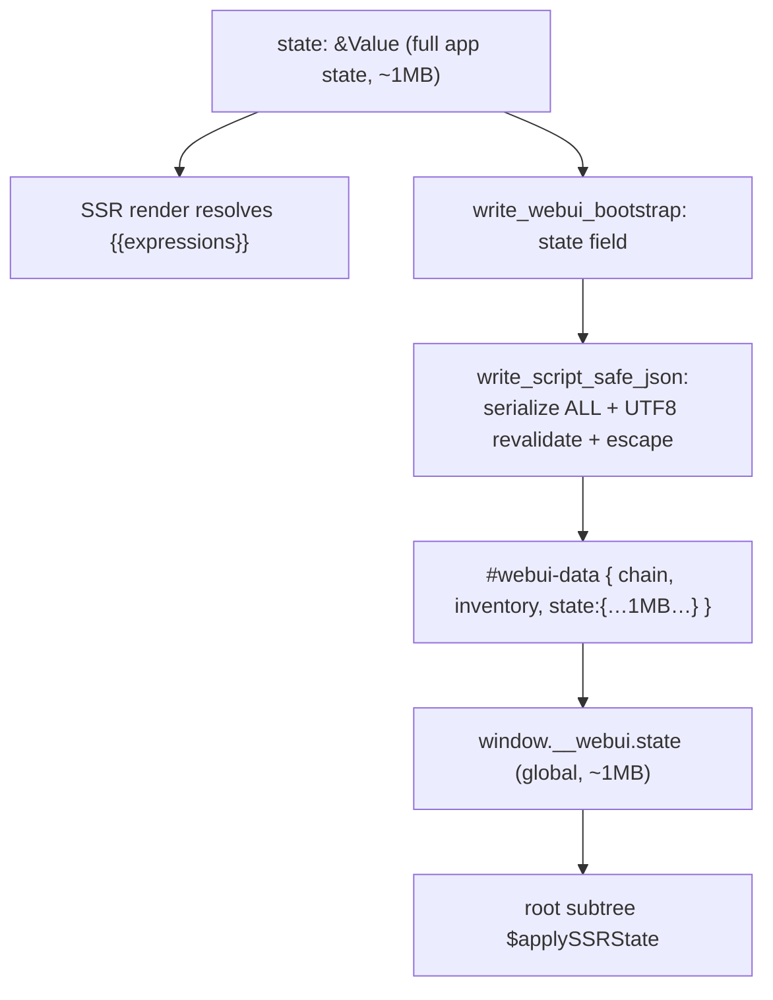
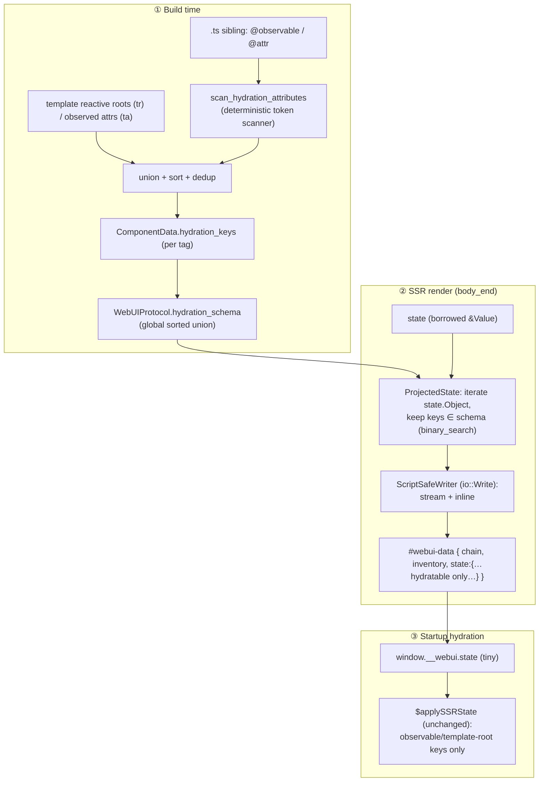

# RFC: Build-Time Hydration Schema with Runtime State Projection

**Status:** Accepted · implementing · **Author:** session `Handler state emission`
**Scope:** `webui-parser`, `webui-discovery`, `webui`, `webui-protocol`, `webui-handler`, `webui-framework`
**Breaking:** Yes — no backwards compatibility. The `#webui-data` `state` field is projected to a build-time allowlist; the subtractive `tokens` strip is removed.

> **Supersedes** the original *"Plugin-Centric Per-Component Hydration Schema"* proposal (co-located positional value blocks + a rich `HydrationSchema` protobuf message). That design was rejected during implementation because it duplicated shared-state bytes across authored instances and was justified by an `O(N·K)` client cost that the framework does not actually pay (see §16). This revision documents the design that shipped.

---

## 1. Summary

Keep the single consolidated `<script type="application/json" id="webui-data">` bootstrap block, but **shrink its `state` field to only the fields components actually hydrate.**

The hydratable surface of every component is computed **at build time** as a sorted, deduplicated set of property names — the union of the `@observable` / `@attr` reactive surface scanned from the component's sibling `.ts`/`.js` and the template reactive roots (`tr`) / observed attributes (`ta`) already extracted by the compiler. Each component's set is stored on `ComponentData.hydration_keys`; a precomputed global union is stored on `WebUIProtocol.hydration_schema`.

At render time the handler **projects** the borrowed application state down to that allowlist and streams it through a single-pass, zero-copy `</`-escaping serializer — no whole-state `serde` round-trip, no intermediate buffer, no UTF-8 revalidation, no second `</` scan. The client is unchanged: it still reads `window.__webui.state`, but that object is now tiny.

The core shift: **the compiled allowlist *is* the wire filter.** Server-only fields (e.g. CSRF `tokens`) are never in any component's hydration set, so they are dropped by construction — the filter is positive, not subtractive.

---

## 2. Motivation

### 2.1 The measured hot path

Full-HTML SSR emits one consolidated block. The `state` field was written by `write_webui_bootstrap` through `write_script_safe_json`:

```rust
// crates/webui-handler/src/lib.rs (baseline) — monolithic serialization
let mut json = Vec::with_capacity(256);
serde_json::to_writer(&mut json, value)?;   // ① serialize the ENTIRE state
let json = std::str::from_utf8(&json)?;      // ② full UTF-8 re-validation
write_script_safe_json_str(writer, json)?;   // ③ second pass: scan for </
```

For a ~1 MB state this is three linear passes over ~1 MB (grow-and-realloc serialize, UTF-8 validate, `</`-escape scan) **regardless of how little of that state is hydrated**. The committed benchmark (`crates/webui-handler/benches/bootstrap_state_bench.rs`) confirms the cost is dominated by this serialization and scales linearly:

| Serialized state | With bootstrap block | Without block |
|---|---|---|
| 64 KB | 64.18 µs | ~80 ns |
| 256 KB | 243.09 µs | ~80 ns |
| **1 MB** | **1.5574 ms** | ~80 ns |

The `with`/`without` delta *is* the serialization cost. This is the reported CPU spike at startup.

### 2.2 Most of that data is never hydrated

The `state` object typically mixes a small reactive surface (a handful of `@observable`/`@attr`-backed fields and template roots) with large non-hydrated payloads (record arrays, normalized collections, render-only tokens). The client only ever reads the reactive keys; the rest is serialized, shipped, parsed, and ignored. Projecting to the hydratable set removes that waste at the source.

### 2.3 Guiding principle

> **Move the decision to build/startup, apply zero-copy at runtime.**

The hydratable field set per component is statically knowable at build time. The runtime should filter and emit *values* against a pre-agreed set, with no per-request set construction and no whole-state serialization.

---

## 3. Goals / Non-Goals

**Goals**
- Eliminate whole-state JSON serialization on the SSR hot path; emit only hydratable fields.
- Compute the hydratable surface at build time and carry it in the existing `prost`/protobuf pipeline (no ad-hoc side channel).
- Keep runtime membership zero-allocation (binary search over a pre-sorted slice) and emission single-pass/streaming.
- Make server-only fields structurally un-leakable (positive allowlist).
- Add a ~1 MB state benchmark that gates regressions.

**Non-Goals**
- Backwards compatibility. The `state` field is now projected; the `tokens` strip and `ClientState` wrapper are deleted.
- Rewriting the client hydration algorithm. `$applySSRState` keeps reading `window.__webui.state`; only the payload shrinks.
- Per-instance/co-located value blocks (rejected — see §16).
- Reworking template metadata (`template_json` / `templateFns`) delivery — orthogonal.
- Per-route allowlist tightening — desirable but deferred (see §14).

---

## 4. Current Architecture (baseline)



Ownership today: the host supplies `state`; the **handler** serializes the whole thing; the client parses the whole thing and uses a sliver.

---

## 5. Proposed Architecture



### 5.1 Responsibility split

| Concern | Owner |
|---|---|
| Which property names are hydratable (per component) | **`webui-parser` WebUI plugin** (owns the `@observable`/`@attr` scan) ∪ its **template build metadata** (`tr`/`ta`), at build time. Other plugins derive their own surface. |
| Global allowlist union | **`webui` build** (`build_protocol_inner`) |
| Schema storage / transport | **protobuf** (`ComponentData.hydration_keys`, `WebUIProtocol.hydration_schema`) |
| Projecting + streaming the state field | **`webui-handler`** (`ProjectedState` + `ScriptSafeWriter`) |
| Applying values to instances | **`webui-framework`** client runtime (`$applySSRState`, unchanged) |

---

## 6. Build-Time Schema Extraction

### 6.1 Scanner (`crates/webui-parser/src/hydration.rs`)

`scan_hydration_attributes(source: &str) -> Vec<String>` is a **deterministic byte/token scanner** (no regex, no recursion — per repo policy). It matches `@observable` / `@attr` decorators, skips balanced `(...)` option groups (with string-literal awareness) and stacked decorators, skips any TypeScript member modifiers (`public`/`private`/`protected`/`readonly`/`static`/`declare`/`override`/`accessor`/`abstract`) as well as `get`/`set` accessor keywords (so `@observable get fullName()` reads `fullName`, not `get`) and line/block comments between the decorator and the property, and reads the following property identifier. UTF-8 identifier bytes (`>= 0x80`) are treated as identifier characters. Output is sorted and deduplicated.

There is **no Rust TypeScript AST parser available** (esbuild bundles `.ts` opaquely), so a full AST parse — as an earlier draft assumed — is not feasible at Rust build time. The token scanner is the pragmatic, policy-compliant substitute.

### 6.2 Safety bias (correctness-critical)

> **Over-inclusion is harmless; under-inclusion silently breaks hydration.**

If a key that no component reads is included, the client ignores it (a few wasted bytes). If a key a component *needs* is dropped, that field silently fails to seed from SSR. Therefore:

- The scanner **errs toward matching**: its decorator-matching pass needs no robust comment/string skipping (over-inclusion is harmless), though once a decorator matches it does skip TS member modifiers and intervening comments so the correct property identifier is read.
- The schema is a **union** of the scan with the template reactive roots (`tr`) / observed attributes (`ta`), so a scanner miss is backstopped by the template surface and vice-versa.

### 6.3 Plugin-owned scanning

The `@observable`/`@attr` convention is **owned by the WebUI parser plugin**
(`crates/webui-parser/src/plugin/webui.rs`), not by the plugin-agnostic
registration pipeline. Registration only carries the component's **raw client
module** — `Component::script_source` — so any plugin can derive its own
hydration surface (or ignore it). The WebUI plugin is the sole caller of
`scan_hydration_attributes`; it scans each component's `script_source` exactly
once, in `take_component_templates`, and unions the result with the template
reactive roots, attaching the set through the plugin-agnostic
`ComponentTemplateArtifact::with_hydration_keys` builder — the single hook any
plugin (WebUI or third-party) uses to declare its hydratable surface.

Sources of `script_source`:

- **App-directory components** — `register_component_from_paths` (`webui-parser`) reads the sibling `.ts`/`.js` and stores it verbatim on the `Component`.
- **External `--components`** — discovery surfaces the source through `DiscoveredComponent.script_content`; the `webui` crate passes it as `ComponentRegistration::script_source`.
- **Wasm build** — `webui-wasm` locates the sibling module in its in-memory file map and passes it through the same field.
- **npm / cached components** — have no scannable sibling (they are precompiled), so `script_source` is `None` and their hydratable surface is **template roots only**. A JS-only `@observable` on such a component that never appears in a template binding will not be in the schema (accepted limitation; see §14).

---

## 7. Protobuf Schema Changes

Reuse `prost`. Two additions in `crates/webui-protocol/proto/webui.proto`:

```proto
message ComponentData {
  string template = 1;
  string css = 2;
  string css_href = 3;
  string template_json = 4;
  string template_functions = 5;
  // Build-time hydration allowlist for this component: the property names the
  // client consumes from SSR state. Union of the sibling `.ts`
  // (`@observable`/`@attr`) reactive surface and the template reactive roots
  // (`tr`) / observed attributes (`ta`). Sorted and deduplicated. Empty for
  // components with no hydratable surface.
  repeated string hydration_keys = 6;
}

message WebUIProtocol {
  map<string, FragmentList> fragments = 1;
  repeated string tokens = 2;
  map<string, ComponentData> components = 3;
  CssStrategy css_strategy = 4;
  DomStrategy dom_strategy = 5;
  // Sorted, deduplicated union of every component's `hydration_keys`.
  // Precomputed at build time so the handler can project SSR state to the
  // hydratable surface in a single pass without rebuilding the set per request.
  repeated string hydration_schema = 6;
}
```

A flat `repeated string` is deliberately the minimum representation the runtime needs. There is no per-field `kind`/`source_path`/`producer`: the projected object keeps its keys, and `serde_json::Value` already carries each value's type, so a positional-array contract and a scalar-kind enum would be redundant complexity.

**Cascade** per the protocol-evolution checklist: proto → `gen_webui.rs` (regenerated via `cargo xtask proto`) → `lib.rs` constructors (`hydration_schema: Vec::new()`) → handler consumption. `prost` repeated fields expose a `pub` `Vec`; assign directly (no generated setter).

---

## 8. Runtime Projection + Zero-Copy Streaming (`webui-handler`)

The `state` field of `write_webui_bootstrap` is emitted by `write_projected_state`, which composes two pieces:

**(a) `ProjectedState` — a `Serialize` wrapper** that iterates the state `Value::Object` and emits only entries whose key is present in the sorted `hydration_schema`, tested by **zero-allocation binary search**:

```rust
for (key, value) in map {
    if schema.binary_search_by(|k| k.as_str().cmp(key.as_str())).is_ok() {
        out.serialize_entry(key, value)?;
    }
}
```

The schema is sorted at build time, so `binary_search` is valid and costs `O(log S)` per state key with no allocation and no `HashSet` build per request. A non-object state carries nothing hydratable and serializes as `{}`.

**(b) `ScriptSafeWriter` — an `std::io::Write` adapter** over `ResponseWriter` that escapes `</` → `<\/` **inline as bytes stream**, carrying a trailing `<` across `write` boundaries. `serde_json::to_writer(&mut adapter, &projected)` is a **single pass**: no intermediate `Vec`, no whole-buffer UTF-8 revalidation, and no separate `</` scan. A `ResponseWriter`/UTF-8 error is captured on the adapter and surfaced as a `HandlerError` after serialization (an `io::Error` cannot carry it).

**Removed:** the `ClientState` wrapper and `CLIENT_STATE_TOKEN_KEY` constant. The `tokens` strip disappears because render-only tokens were never in a hydration schema — the allowlist is now positive.

The generic `write_script_safe_json` / `write_script_safe_json_str` helpers remain for the small, pre-serialized template metadata strings (`templates` map); only the large `state` field moved to the projected streamer.

---

## 9. Client-Side (`webui-framework`)

**Unchanged algorithm.** `$applySSRState` (`packages/webui-framework/src/template-element.ts:596`) continues to read `window.__webui.state`, iterate `Object.keys(state)`, and apply observable / template-root keys. Because the projected `state` now contains only hydratable keys, the loop is over a tiny object.

Note the earlier draft's premise that *every* instance re-scans the global bag is incorrect: only the root subtree runs the global `$applySSRState`. `<for>` items hydrate from a local `ScopeFrame` (`template-element.ts:1180–1203`), and route components hydrate from indexed slices via `data-ri`. So the projected bag is read a small, bounded number of times — shrinking it is a byte/CPU win, not an algorithmic one (see §12).

The remaining client task is a **verification/trim pass**: confirm the tiny projected bag still satisfies `$applySSRState` and remove any now-dead assumptions about the bag carrying full state.

---

## 10. Router (`webui-router`) — partial navigation

Partial navigation currently returns a `serde_json::Value` (`render_partial` adds no state; `render_action_response` inserts `state` as-is) that the **host** serializes (`crates/webui-handler/src/route_handler.rs:895`, `:971`; `DESIGN.md:329`). These paths carry route-scoped slices applied via `setState()`, not the initial-bootstrap 1 MB blob, so they are **outside the measured hot path**. If profiling shows they carry excess data, the same projection can be applied to the returned `Value` before the host serializes it; this is deferred (see §14).

---

## 11. Security — positive allowlist

Server-only fields (CSRF `tokens`, secrets, normalized server caches) are never declared `@observable`/`@attr` and never appear as template reactive roots, so they are **absent from every component's `hydration_keys`** and therefore from the global `hydration_schema`. Projection drops them by construction. SSR can still *read* such fields during rendering (e.g. `tokens.light` resolving an inline `<style>`, `DESIGN.md:1387`) — reading server-side and shipping client-side are now cleanly separated by the positive filter, replacing the old subtractive `tokens` strip.

---

## 12. Performance Analysis

| Aspect | Baseline (monolithic) | This design (projected) |
|---|---|---|
| Server serialize | whole state (~1 MB), 3 passes | only hydratable keys, 1 streaming pass |
| Server intermediate buffer | `Vec` of full JSON | none (stream to `ResponseWriter`) |
| Server UTF-8 revalidate | full 1 MB | none (serde emits valid UTF-8; adapter validates per chunk only to honor the `&str` API) |
| Server `</` scan | separate full pass | inline during the single pass |
| Per-request set build | n/a | none — `binary_search` over pre-sorted slice |
| Client payload | full state | hydratable subset |
| Server-only leakage | needs subtractive filter | impossible (positive allowlist) |

The win is a **large constant-factor reduction** in bytes and CPU on the server hot path (K shrinks from "all state keys" to "hydratable keys"), plus a smaller client payload — **not** an asymptotic change in the client hydration loop (that loop was never `O(N·K)`; see §16).

---

## 13. Benchmark Plan (lands first, gates the work)

`crates/webui-handler/benches/bootstrap_state_bench.rs`:

- `build_large_state(target_bytes)` → realistic nested records summing to ~64 KB / 256 KB / **1 MB** serialized.
- `build_bootstrap_protocol()` → full HTML page firing `body_end`, `WebUIHydrationPlugin` active so the block is emitted.
- **Baseline (captured before the change):** with/without-plugin wall time and throughput at each size — the delta isolates serialization cost. Recorded numbers in §2.1.
- **Post-change (bench-verify):** set a realistic `WebUIProtocol.hydration_schema` on the protocol and measure two arms:
  - *projected-typical* — schema selects a few metadata keys of the 1 MB payload (the giant array is not hydratable): expect the emitted `state` to collapse to a sliver and wall time to drop toward the no-block floor.
  - *projected-full* — schema selects every top-level key so the whole 1 MB streams through `ScriptSafeWriter`: the **anti-regression guard** proving the streaming escaper is no slower than the old `Vec`-based serializer at equal bytes.

---

## 14. Risks & Mitigations / Future Work

| Risk | Mitigation |
|---|---|
| Scanner misses a decorator variant (factory `@attr({...})`, stacked, mixins) | Union with template `tr`/`ta`; over-inclusion is harmless; scanner errs toward matching. |
| Sibling module present but unreadable (I/O error / non-UTF-8) | **Hard build error**, never a silent script-less skip — silently dropping it would omit the component's `@observable`/`@attr` keys and under-include the schema (the one failure mode §6.2 forbids). |
| npm/cached component with a JS-only `@observable` not in any template binding | Template-root surface only for npm; documented limitation. **Future:** ship hydration keys in the component cache format. |
| Global-union over-inclusion emits keys no reachable component needs | Safe (never drops a needed key). **Future:** per-route allowlist derived from reachable components tightens the projection. |
| Non-object state now serializes as `{}` (was passthrough) | Intentional under no-backcompat; state is contractually an object. Documented in `DESIGN.md`. |
| Spec/code drift | Update `DESIGN.md` §(state block) to state that `state` is projected to the hydratable surface, in the same change. |

---

## 15. Rollout / Sequencing

1. **Benchmark** (`bootstrap_state_bench.rs`) + baseline numbers. *(gate — done, `873e745d`)*
2. **Build-side schema** — scanner + discovery plumbing + protobuf (`hydration_keys`, `hydration_schema`) + global union. *(done, `06702bfe`)*
3. **Handler** — `ProjectedState` + `ScriptSafeWriter` + `write_projected_state`; delete `ClientState`/`CLIENT_STATE_TOKEN_KEY`. *(this change)*
4. **Benchmark verify** — projected-typical + projected-full arms; compare vs the §2.1 baseline.
5. **Client** — verify/trim `$applySSRState` against the tiny projected bag.
6. **Docs** — `DESIGN.md` §(state block) + `docs/`; `cargo xtask check`.

---

## 16. What changed from the original proposal

The first draft proposed **per-component co-located positional value blocks** (`<script data-h>[5,"Inbox",true]</script>`) backed by a rich `HydrationSchema { repeated HydrationField (property, kind, source_path); producer }` message and an `emit_hydration_payload` plugin hook, with the client rewritten to index-assign `this.constructor.$hydrate[i] = values[i]` and `window.__webui.state` deleted.

It was rejected during implementation for concrete reasons:

- **Byte regression.** A per-instance block co-located with each authored instance **duplicates** shared/normalized fields across every instance of a tag — a payload-size regression on the very axis the RFC set out to improve.
- **The `O(N·K)` premise was wrong.** Only the root subtree reads the global bag; `<for>` items use a local `ScopeFrame` (`template-element.ts:1180–1203`) and route instances use indexed `data-ri` slices. There is no per-instance re-scan of a K-key global bag to eliminate, so the claimed `O(N·K) → O(Σ fields)` complexity-class win does not exist.
- **Accidental complexity.** `HydrationKind` duplicates type information already in `serde_json::Value`; `source_path` and a positional order contract exist only to support positional arrays; `producer` dispatch is unneeded when the client keys by name. The flat `repeated string` allowlist is the right size.
- **Infeasible extraction mechanism.** "True TS AST via the bundler's parser" is not available at Rust build time; a deterministic token scanner unioned with template roots is the workable, policy-compliant approach.

The projected-single-block design keeps the parts that were right (the measured hot path, the guiding principle, protobuf carriage, benchmark-first, the positive-allowlist security property) and drops the parts that were not.
